# Exercise 1 - Ingest data from various sources using pipelines and dataflows 

> [!NOTE]
> Timebox: 60 minutes
> 
> Back to [Agenda](./../README.md#agenda)

# Context
%TODO STORY

# Task 1.1 Create a pipeline that ingests data from an external Azure Blob Storage account and writes it to Lakehouse (Bronze layer)

## Required to complete the exercise
* Blob Storage Account URL `https://transportationkotcorp.blob.core.windows.net/`
* SAS Token (Read Only) `sv=2022-11-02&ss=bfqt&srt=sco&sp=rwdlacupiytfx&se=2024-08-31T04:00:16Z&st=2024-03-19T20:00:16Z&spr=https&sig=Av5yc0Q3W5bSncVDP2DpfkZ5nbb%2BXj4tqjC1Chwi3Hw%3D`

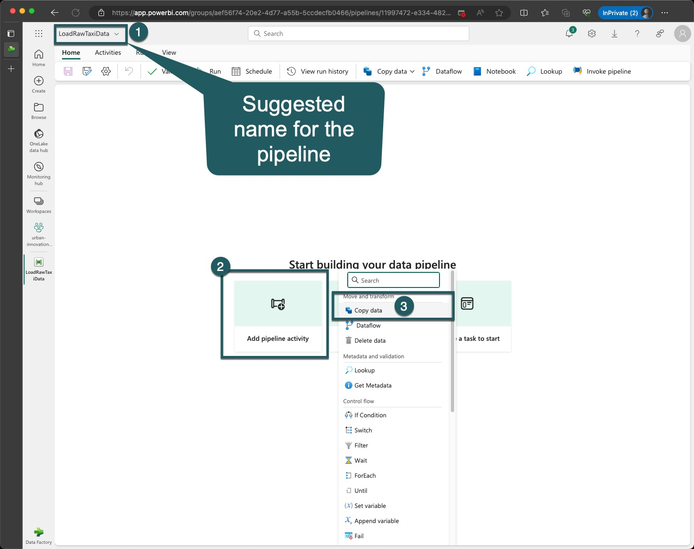

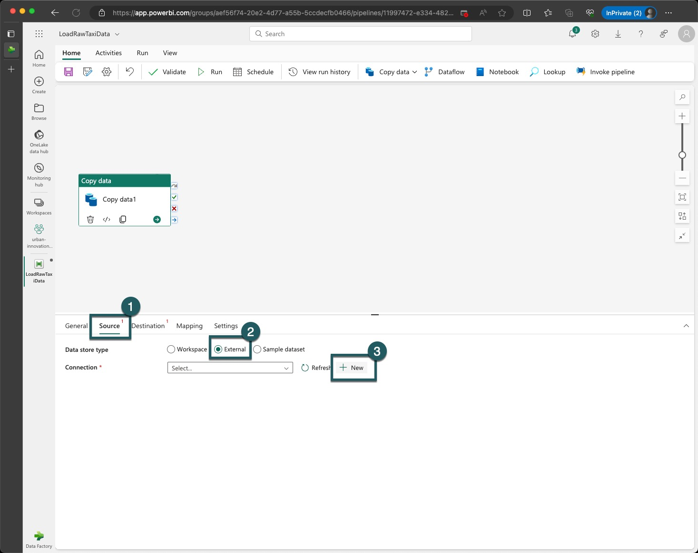

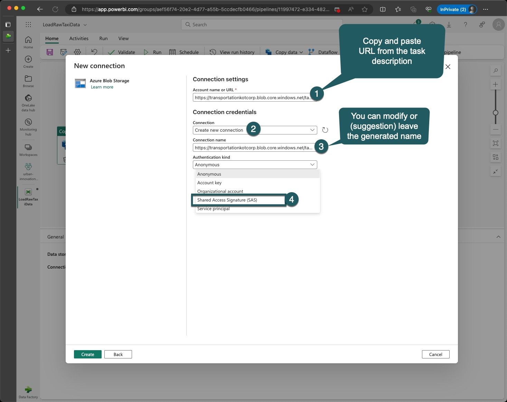
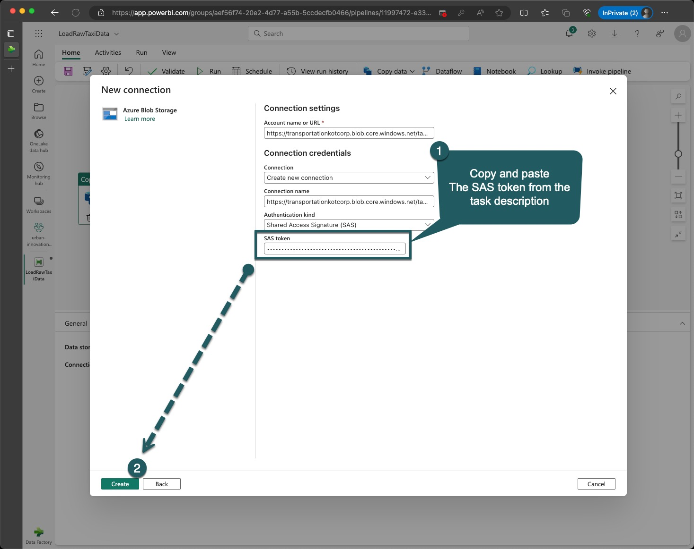

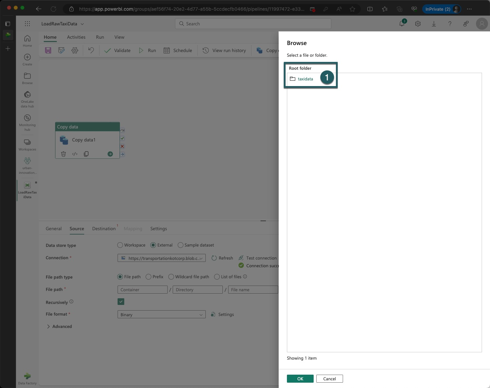

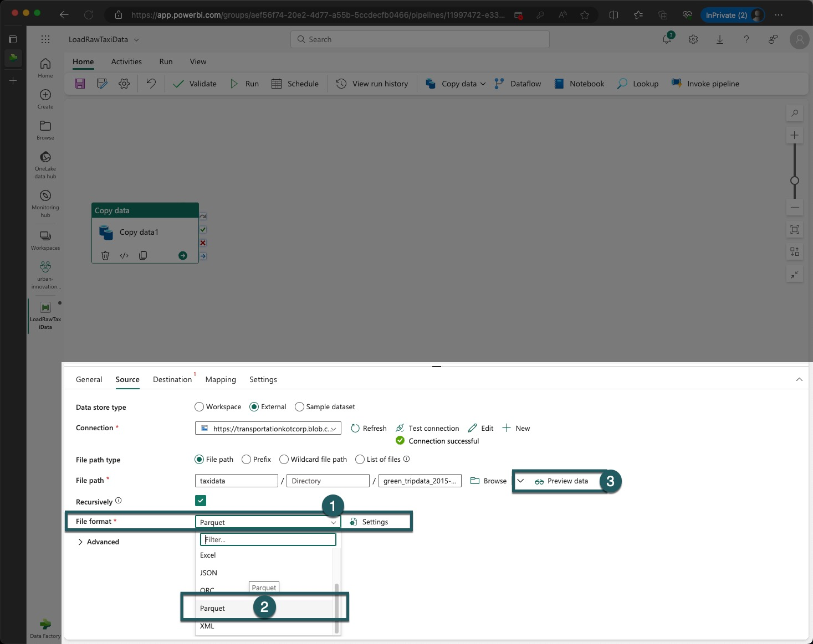

# Task 1.2 Discover the Lakehouse 

Microsoft Fabric lakehouses are designed to provide data engineers and analysts with the benefits of both data lake storage and a relational data warehouse. Apache Spark is a critical technology for big data analytics, and its support within Microsoft Fabric allows you to seamlessly integrate Spark's big data processing capabilities with the other data analytics and visualization tools available on the platform. 
By using a lakehouse, you can create an end-to-end data analytics solution that includes data ingestion, transformation, modeling, and visualization. The lakehouse provides a unified and scalable platform for storing and managing data, allowing you to easily access and analyze both structured and unstructured data. Additionally, the platform's built-in security and compliance features help ensure that your data is always secure and compliant with industry standards.

**The foundation of Microsoft Fabric is a Lakehouse**, which is built on top of the **OneLake** scalable storage layer and uses **Apache Spark** and **SQL** compute engines for big data processing. A Lakehouse is a unified platform that combines:
- The flexible and scalable storage of a data lake
- The ability to query and analyze data of a data warehouse

Some benefits of a lakehouse include:
- Lakehouses use Spark and SQL engines to process large-scale data and support machine learning or predictive modeling analytics.
- Lakehouse data is organized in a schema-on-read format, which means you define the schema as needed rather than having a predefined schema.
- Lakehouses support ACID (Atomicity, Consistency, Isolation, Durability) transactions through Delta Lake formatted tables for data consistency and integrity.
- Lakehouses are a single location for data engineers, data scientists, and data analysts to access and use data.

A Lakehouse is a great option if you want a scalable analytics solution that maintains data consistency.

Imagine your company has been storing structured data from NYC Taxi's transactional system, such as trip history, passenger counts, and fare information in a data warehouse. However, you have also collected unstructured data from social media, website logs, and third-party sources related to NYC Taxi, which are difficult to manage and analyze using the existing data warehouse infrastructure.

Your company's new directive is to improve its decision-making capabilities by analyzing data in various formats across multiple sources. Therefore, the company decides to **leverage Microsoft Fabric's capabilities to analyze and manage these diverse datasets more efficiently**.

###  Data ingestion into lakehouse
Easily ingest data into the lakehouse through a variety of methods

* Get files from your computer using direct upload
* Connect to 120+ data sources and apply multiple transformations using Dataflows or copy petabyte-sized lakes using the copy activity in Pipelines
* Use Spark code to connect to data sources using available Spark libraries
* Leverage shortcuts to create pointers to existing data in OneLake and external storage accounts with no data movement at all
* Shortcuts behave in the same way as hosted storage

# Task 1.3 Create shortcut

## Required to complete the exercise
* Blob Storage Account URL `https://transportation23kotcorp.dfs.core.windows.net/`
* SAS Token (Read Only) `sv=2022-11-02&ss=bfqt&srt=sco&sp=rwdlacupyx&se=2024-08-31T05:45:27Z&st=2024-03-19T21:45:27Z&spr=https,http&sig=ifGqJa6706RCFaciJapwOL6vHoKzy9ltno3LznjQMkY%3D`

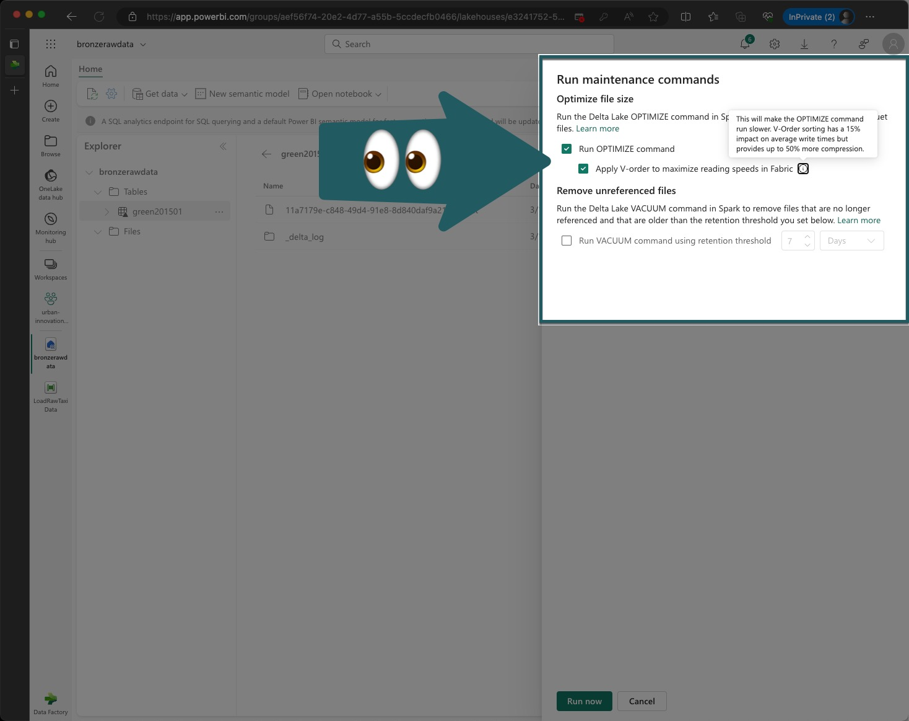

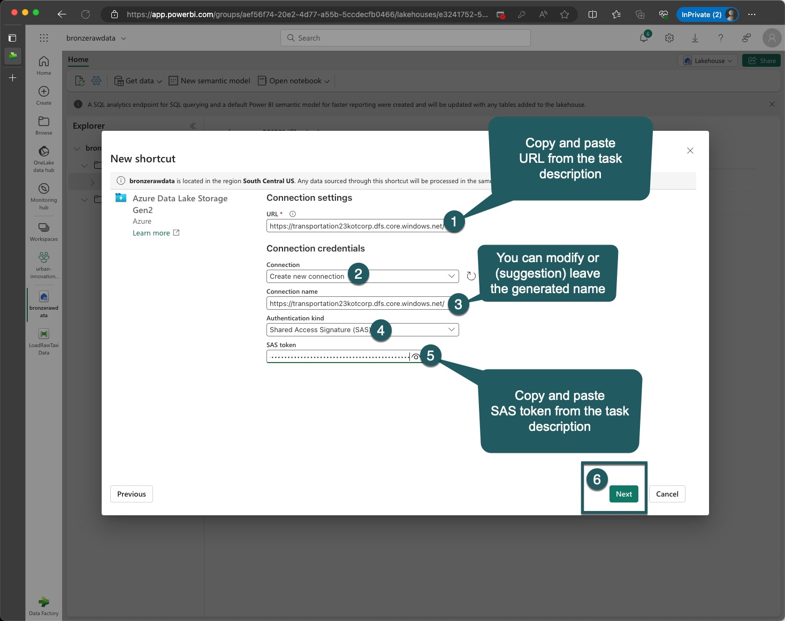

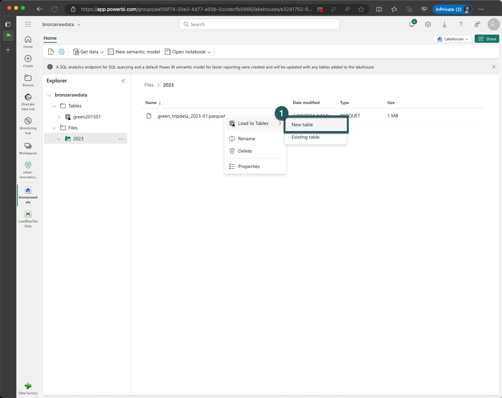

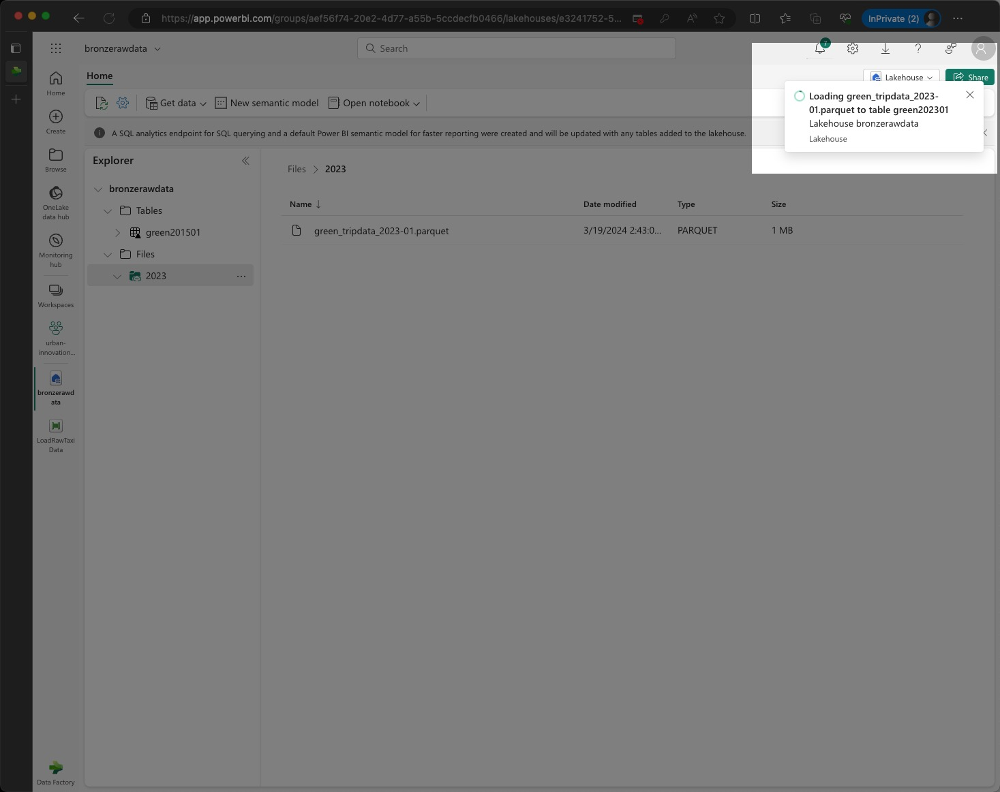

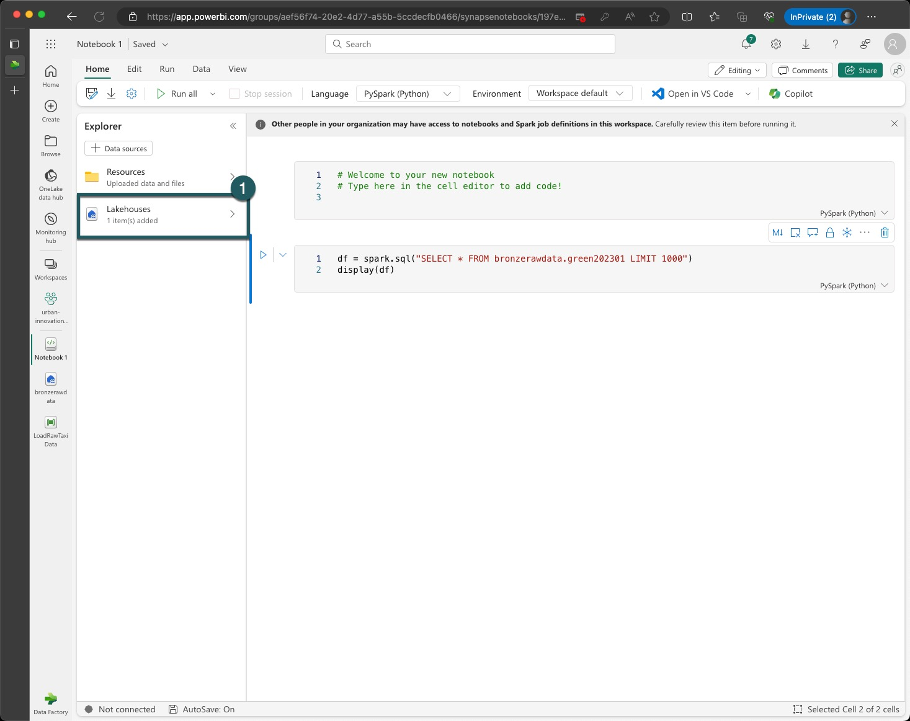

## Create shortcut to External ADLS Gen2

To create a shortcut, open Lakehouse Explorer and select where to place the shortcut under Tables or Files. Creating a shortcut to Delta formatted table under Tables in Lakehouse Explorer will automatically register it as a table, enabling data access through Spark, SQL endpoint, and default dataset. Spark can access shortcuts in Files for data science projects or for transformation into structured data.

**Objective: In this step, we aim to merge two datasets: the `NYC_Taxi` delta table that currently resides in our lakehouse, and an external dataset located in ADLS Gen 2 that contains information about discounts offered on specific days. The final table will reflect all records from the `NYC_Taxi` dataset with an additional column from the discount dataset, allowing us to see the total discount value per vendor for a given day. This will enable us to gain insights into how vendors offer discounts and how it impacts their revenue.**

Connection settings:
- URL: 
- Connection: Create new connection
- Connection name: NewConnectionToADLS
- Authentication kind: `Shared Access Signature (SAS)`
- SAS token: 

**If you encounter the error message "The specified connection name already exists. Try choosing a different name", please make sure that the name you choose for the connection is unique.**

> [!IMPORTANT]
> Once completed, go to [Exercise 2](./../exercise-2/exercise-2.md) or continue with [Advanced steps below](#advanced-steps).

# Advanced steps

# Task 1.2 Use a Copy Data activity to configure the source and sink datasets, and specify the file format and compression type.

# Task 1.3 Monitor the pipeline run and verify the output files in the data lake.

# Task 1.4 Create a dataflow that reads data from a CSV file in the data lake and performs some transformations, such as filtering, joining, aggregating, and mapping.

# Task 1.5 Use the data preview and debug features to inspect the data at each step of the transformation.
Write the transformed data to a Delta table in the Lakehouse.

# Task 1.6 Run the dataflow and monitor the Spark job execution details. 

> [!IMPORTANT]
> Once completed, go to [Exercise 2](./../exercise-2/exercise-2.md).