# Exercise 1 - Ingest data from various sources using pipelines and dataflows 

> [!NOTE]
> Timebox: 60 minutes
> 
> Back to [Agenda](./../README.md#agenda)

# Context
As aspiring data engineers, your primary role will be to orchestrate the ingestion and integration of data within a Lakehouse architecture. This exercise is designed to empower you with hands-on experience in handling real-world data workflows, essential for innovative solutions in the transportation sector.

Our immediate goal is to successfully launch and organize raw data within a Lakehouse environment, adhering to the medallion architecture principles. This process is fundamental as we pave the way for transformative transportation innovations.

Tasks Overview:
* Data Ingestion: Initiate by loading historical data assets from the year 2015, a period when Azure Blob Storage was the zenith of data storage solutions. This step will simulate the transition of legacy data into a modern data ecosystem.
* Data Integration and Analysis: Shift focus to more recent data, specifically from January 2023. During this time, Azure Data Lake Storage Gen 2 (ADLS Gen2) became the benchmark for data storage in Azure. Instead of traditional data copying methods, you will leverage the innovative 'Shortcuts' feature to streamline the integration process within our Lakehouse architecture.

Timebox: You have one hour to complete these essential tasks. Completing these foundational steps is crucial as they form the groundwork for subsequent exercises in this workshop.

For those who complete the primary tasks ahead of time, we've prepared additional challenges. These are designed to deepen your understanding and skills in data engineering. You'll find these at the bottom of the page.

Questions are not just welcome; they are encouraged! Feel free to reach out to any of our hosts throughout the session. Collaboration and curiosity are key components of success in this exercise.

Let the data engineering journey begin! 

# Task 1.1 Create a pipeline that ingests data from an external Azure Blob Storage account and writes it to Lakehouse (Bronze layer)

## 1. **Switch to Data Factory View**
Navigate to the Data Factory section by following the numbered instructions on the screenshot provided.

## 2. **Confirm Data Factory Access** 
Ensure you are in the Data Factory section. Begin exploring data integration at scale using data pipelines.

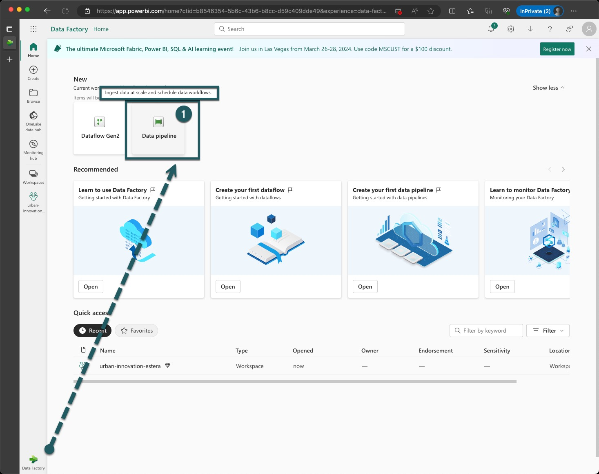

## 3. **Create and Name Your Data Pipeline**
Name your data pipeline, recommended to be "LoadRawTaxiData". Select 'Pipeline Activity' and then 'Copy Data'.

## 4. **Edit Pipeline Elements**
Make adjustments and observe the changes in the main screen's editing area.
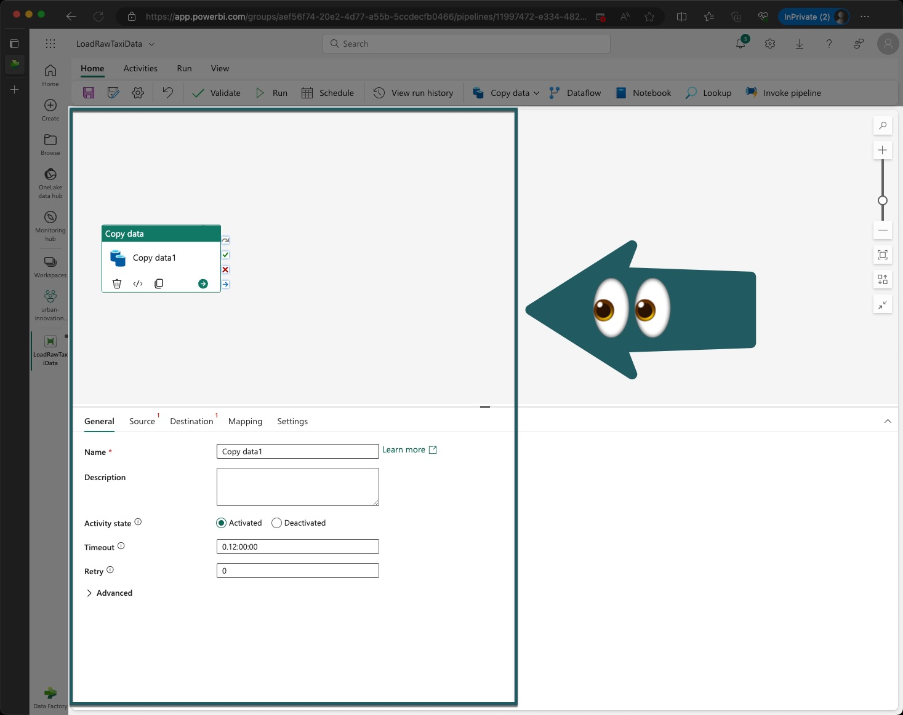

## 5. **Configure Data Store**
In the new tab, set the data store type to 'External' and then click 'New Connection'.

## 6. **Add Connection to Blob Storage**
Change the filter from 'All' to 'Azure' and select 'Azure Blob Storage' for the new connection.
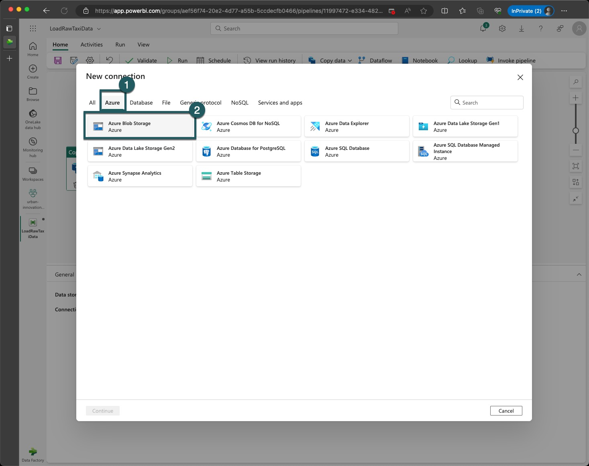

## 7. **Set Connection Details** 
   - Copy and paste the URL from the task description into the relevant field.
     - Blob Storage Account URL `https://transportationkotcorp.blob.core.windows.net/`
   - For connection type, choose 'Create a new connection'.
   - Retain the automatically generated connection name or modify it if necessary.
   - Select 'Shared Access Signature (SAS)' for authentication.

## 8. **Enter SAS Token**
Paste the SAS token from the description. This token grants temporary access to the blob storage, which will expire after a set duration.

SAS Token (Read Only) `sv=2022-11-02&ss=bfqt&srt=sco&sp=rwdlacupiytfx&se=2024-08-31T04:00:16Z&st=2024-03-19T20:00:16Z&spr=https&sig=Av5yc0Q3W5bSncVDP2DpfkZ5nbb%2BXj4tqjC1Chwi3Hw%3D`

## 9. **Test Connection**
Verify that the connection name is correctly displayed, then test the connection. If successful, click 'Browse'.

## 10. **Navigate Blob Storage**
Browse the blob storage and select the 'taxidata' folder.

## 11. **Select Data File**
Choose a specific Parquet file and click 'OK'.

## 12. **File Path and Format**
Note additional elements in the file path section. Change the file format to 'Parquet' and click 'Preview Data'.

## 13. **Preview External Data**
Review the data preview showing the table contents from the external blob storage, then close the preview window.

## 14. **Define Data Destination**
Switch to the 'Destination' tab, select 'Storage Workspace', then 'Lakehouse' and click 'New' to create a new Lakehouse.
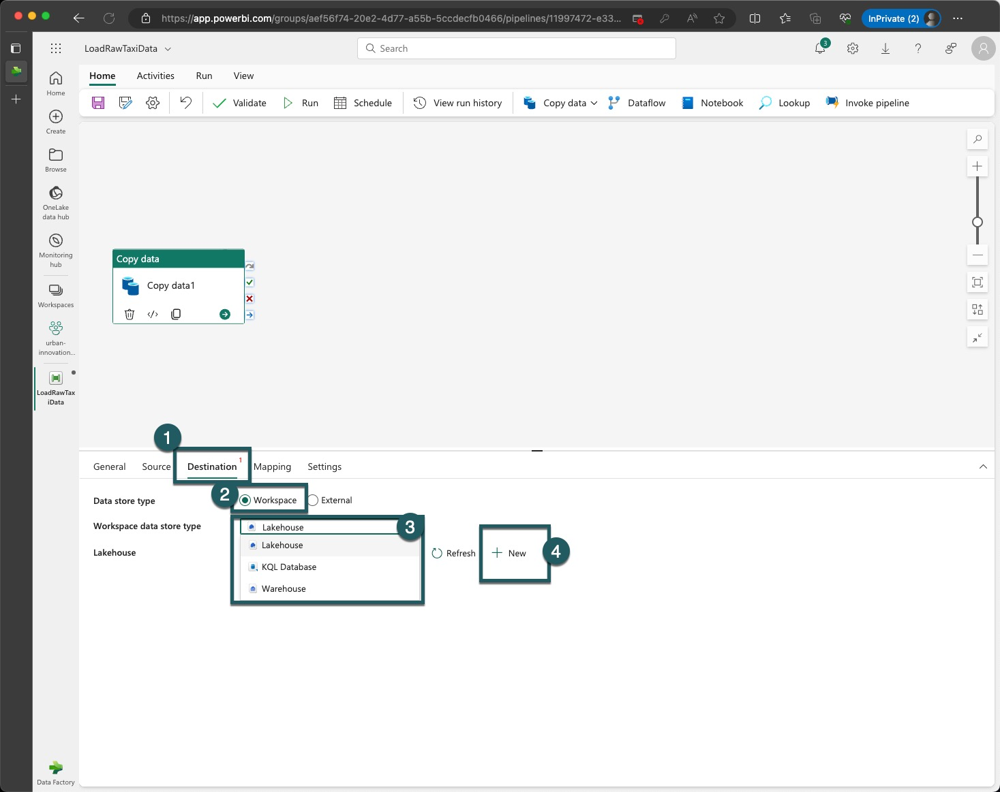

## 15. **Name the Lakehouse**
Follow the naming conventions provided, input the name, and click 'Create'.

## 16. **Review Lakehouse**
Verify the newly created Lakehouse is visible under the appropriate tab.

## 17. **Configure Advanced Options**
Expand the 'Advanced Options' and select the desired table action, such as 'Append'. Specify the table by clicking 'New'.

## 18. **Set Table Name**
Name the table according to the naming conventions, click 'Create', then return to the 'General' tab.

## 19. **Detail Copy Activity**
Name the copy activity to reflect its purpose, e.g., "Load NYC Taxi Green 2015 Jan". Review and, if necessary, adjust the timeout, retry policies, and explore advanced options.
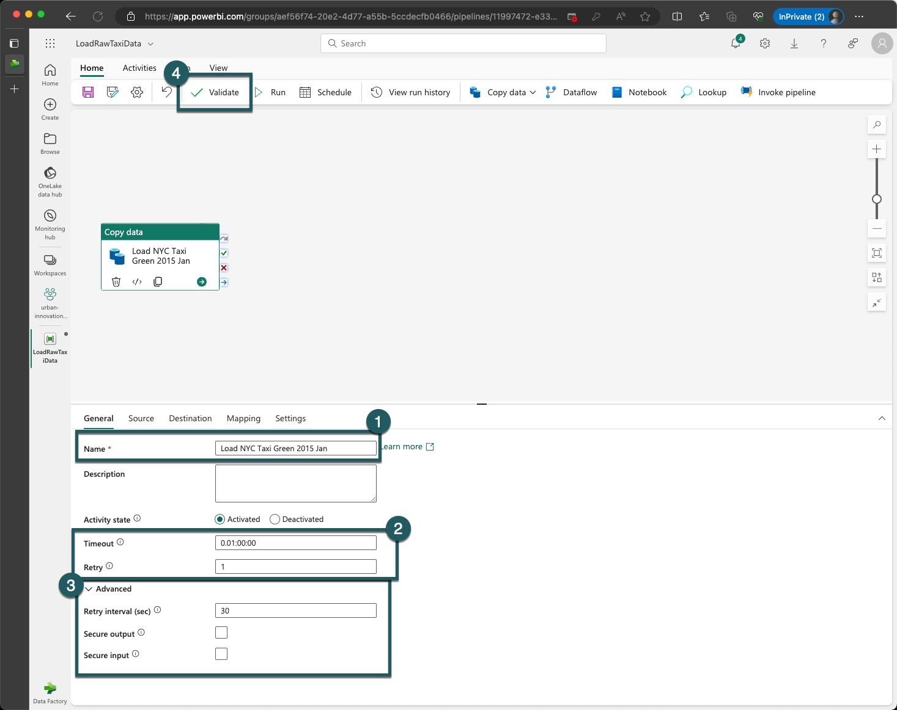

## 20. **Validate Pipeline**
Ensure the pipeline is error-free by clicking 'Validate'. Once validated, close the sidebar.

## 21. **Save and Run Pipeline**
Save your pipeline settings by clicking 'Save', then initiate the pipeline by clicking 'Run'.

## 22. **Monitor Pipeline Execution**
Observe the notification indicating the pipeline is running, then switch to the 'Output' tab.

## 23. **Confirm Pipeline Success**
Check the completion time and ensure the pipeline has succeeded. Click on the highlighted activity name for more details.
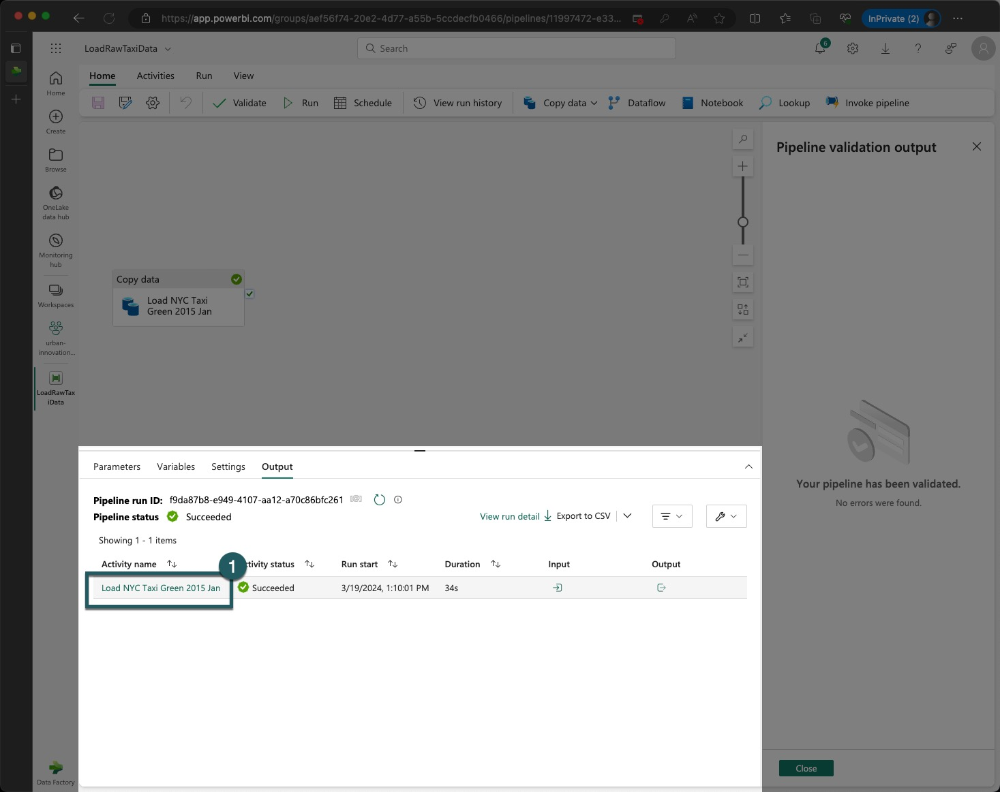

## 24. **Review Data Transfer Details**
In the sidebar, review details such as total duration and the amount of data transferred. Then navigate back to your workspace using the icon indicated as number three.

## 25. **Access Your Workspace**
In your workspace, you should find the 'Load Raw Taxi Data' pipeline and the 'BronzeRawData' Lakehouse. Enter the Lakehouse.

## 26. **Review Data Table**
In the 'Tables' section, observe the new table and preview the data it contains.

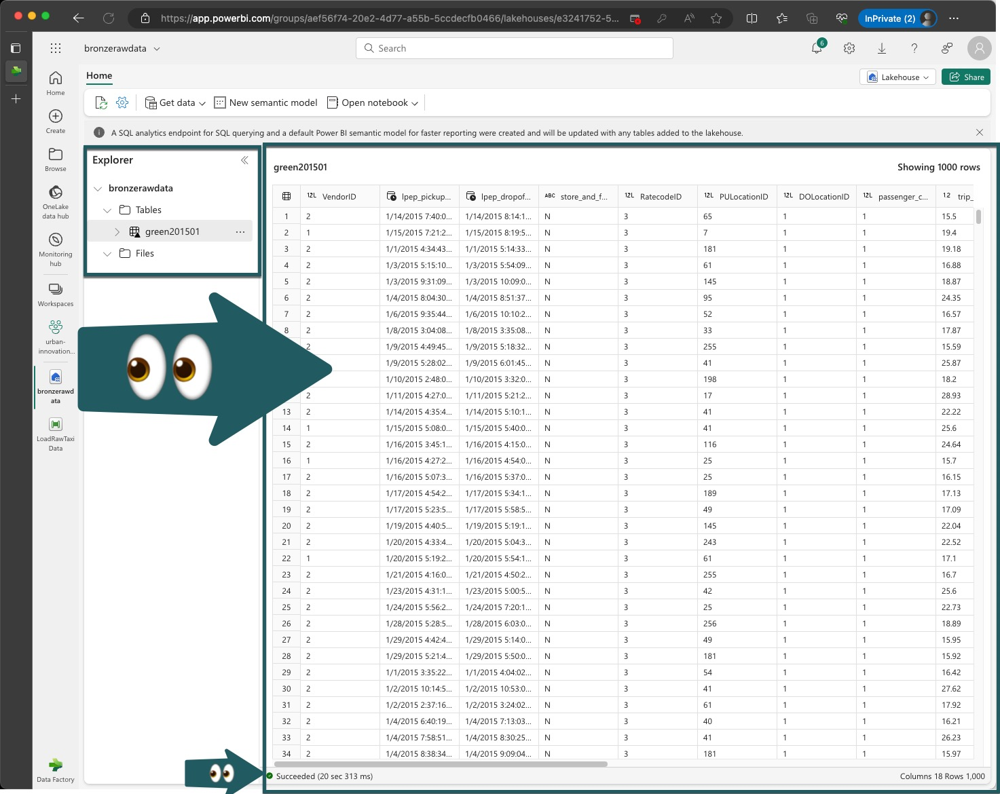

# Task 1.2 Discover the Lakehouse 

Microsoft Fabric lakehouses are designed to provide data engineers and analysts with the benefits of both data lake storage and a relational data warehouse. Apache Spark is a critical technology for big data analytics, and its support within Microsoft Fabric allows you to seamlessly integrate Spark's big data processing capabilities with the other data analytics and visualization tools available on the platform. 
By using a lakehouse, you can create an end-to-end data analytics solution that includes data ingestion, transformation, modeling, and visualization. The lakehouse provides a unified and scalable platform for storing and managing data, allowing you to easily access and analyze both structured and unstructured data. Additionally, the platform's built-in security and compliance features help ensure that your data is always secure and compliant with industry standards.

**The foundation of Microsoft Fabric is a Lakehouse**, which is built on top of the **OneLake** scalable storage layer and uses **Apache Spark** and **SQL** compute engines for big data processing. A Lakehouse is a unified platform that combines:
- The flexible and scalable storage of a data lake
- The ability to query and analyze data of a data warehouse

Some benefits of a lakehouse include:
- Lakehouses use Spark and SQL engines to process large-scale data and support machine learning or predictive modeling analytics.
- Lakehouse data is organized in a schema-on-read format, which means you define the schema as needed rather than having a predefined schema.
- Lakehouses support ACID (Atomicity, Consistency, Isolation, Durability) transactions through Delta Lake formatted tables for data consistency and integrity.
- Lakehouses are a single location for data engineers, data scientists, and data analysts to access and use data.

A Lakehouse is a great option if you want a scalable analytics solution that maintains data consistency.

Imagine your company has been storing structured data from NYC Taxi's transactional system, such as trip history, passenger counts, and fare information in a data warehouse. However, you have also collected unstructured data from social media, website logs, and third-party sources related to NYC Taxi, which are difficult to manage and analyze using the existing data warehouse infrastructure.

Your company's new directive is to improve its decision-making capabilities by analyzing data in various formats across multiple sources. Therefore, the company decides to **leverage Microsoft Fabric's capabilities to analyze and manage these diverse datasets more efficiently**.

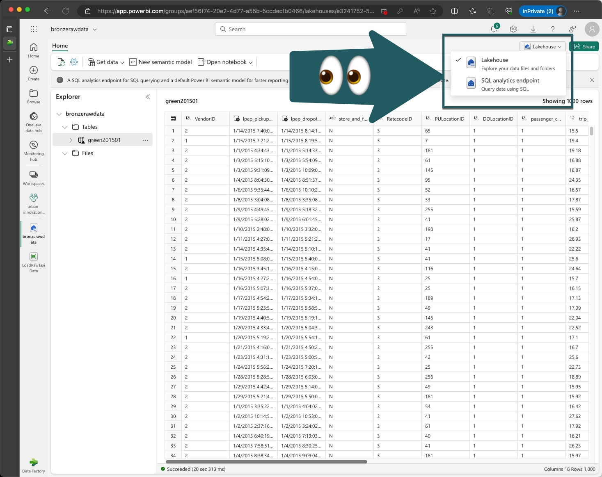

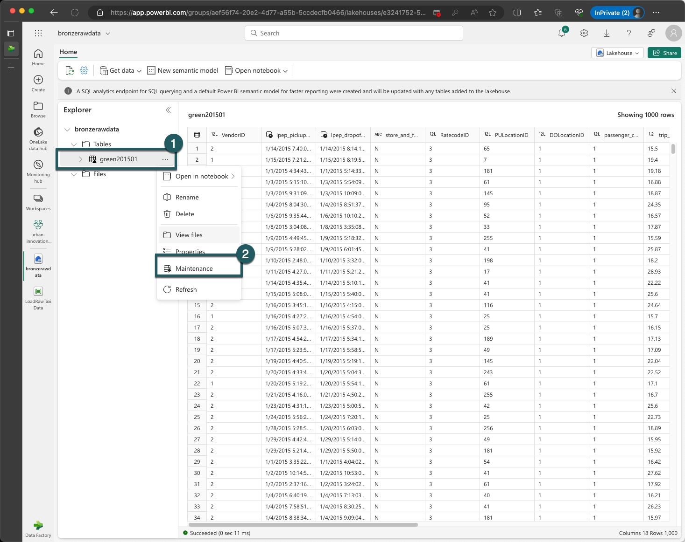

# Task 1.3 Create shortcut

## Required to complete the exercise
* Blob Storage Account URL `https://transportation23kotcorp.dfs.core.windows.net/`
* SAS Token (Read Only) `sv=2022-11-02&ss=bfqt&srt=sco&sp=rwdlacupyx&se=2024-08-31T05:45:27Z&st=2024-03-19T21:45:27Z&spr=https,http&sig=ifGqJa6706RCFaciJapwOL6vHoKzy9ltno3LznjQMkY%3D`

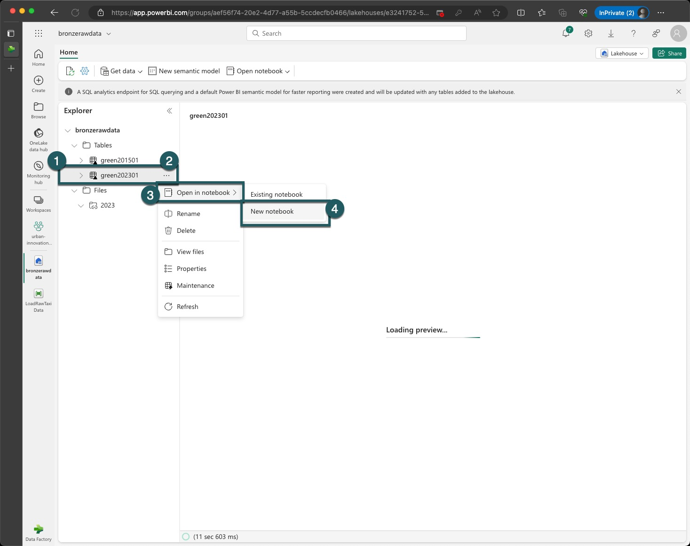

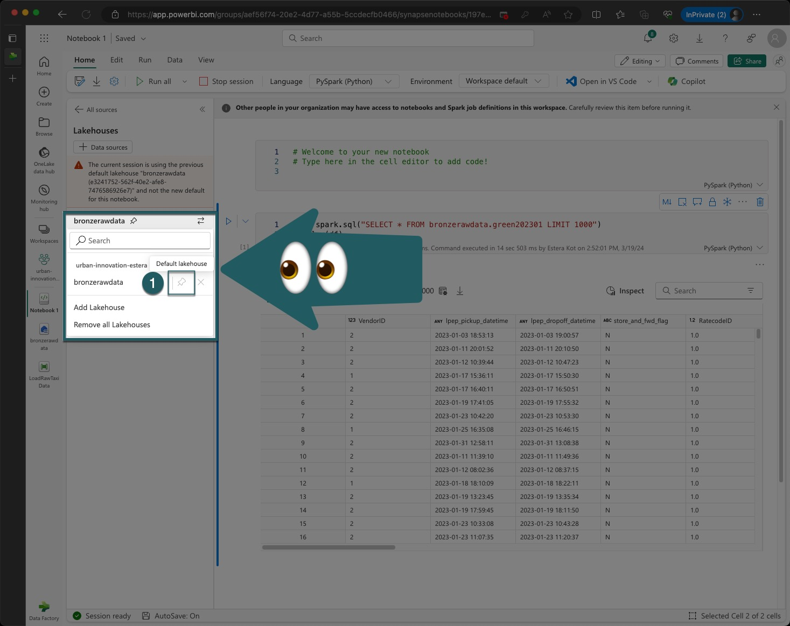

## Create shortcut to External ADLS Gen2

To create a shortcut, open Lakehouse Explorer and select where to place the shortcut under Tables or Files. Creating a shortcut to Delta formatted table under Tables in Lakehouse Explorer will automatically register it as a table, enabling data access through Spark, SQL endpoint, and default dataset. Spark can access shortcuts in Files for data science projects or for transformation into structured data.

**Objective: In this step, we aim to merge two datasets: the `NYC_Taxi` delta table that currently resides in our lakehouse, and an external dataset located in ADLS Gen 2 that contains information about discounts offered on specific days. The final table will reflect all records from the `NYC_Taxi` dataset with an additional column from the discount dataset, allowing us to see the total discount value per vendor for a given day. This will enable us to gain insights into how vendors offer discounts and how it impacts their revenue.**

Connection settings:
- URL: 
- Connection: Create new connection
- Connection name: NewConnectionToADLS
- Authentication kind: `Shared Access Signature (SAS)`
- SAS token: 

**If you encounter the error message "The specified connection name already exists. Try choosing a different name", please make sure that the name you choose for the connection is unique.**

> [!IMPORTANT]
> Once completed, go to [Exercise 2](./../exercise-2/exercise-2.md). If time permits before the next exercise begins, consider continuing with [Advanced steps](./../extra/extra.md).
