# Exercise 1 - Ingest data from various sources using pipelines 

> [!NOTE]
> Timebox: 60 minutes
> 
> [Back to Agenda](./../README.md#agenda) | [Back to Start Steps](./../start/start.md) | [Up next Exercise 2](./../exercise-2/exercise-2.md)
> #### List of exercises:
> * [Task 1.1 Create a pipeline that ingests data from an external Azure Blob Storage account and writes it to Lakehouse (Bronze layer)](#task-11-create-a-pipeline-that-ingests-data-from-an-external-azure-blob-storage-account-and-writes-it-to-lakehouse-bronze-layer)
> * [Task 1.2 Discover the Lakehouse](#task-12-discover-the-lakehouse)
> * [Task 1.3 Create shortcut](#task-13-create-shortcut)

# Context
We will focus on integrating two data sources from NYC Taxi data: one from 2015 and the second from 2023. The table below presents the metaphors we will use to integrate the data:

Tasks Overview:
* Data Ingestion: Initiate by loading historical data assets from the year 2015, a period when Azure Blob Storage was the zenith of data storage solutions. This step will simulate the transition of legacy data into a modern data ecosystem.
* Data Integration and Analysis: Shift focus to more recent data, specifically from January 2023. During this time, Azure Data Lake Storage Gen 2 (ADLS Gen2) became the benchmark for data storage in Azure. Instead of traditional data copying methods, you will leverage the innovative `Shortcuts` feature to streamline the integration process within our Lakehouse architecture.

By the end of the workshop, we will have completed the first step, the bronze layer, of the medallion architecture:
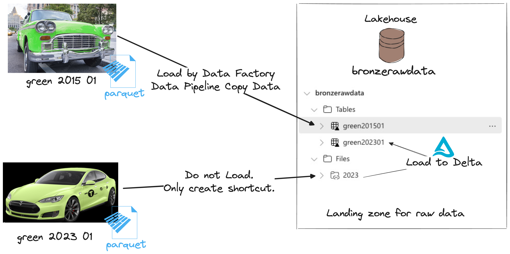

For those who complete the primary tasks ahead of time, we've prepared [additional challenges](./../extra/extra.md). These are designed to deepen your understanding and skills in data engineering. You'll find these at the bottom of the page. Questions are not just welcome; they are encouraged! Feel free to reach out to any of our hosts throughout the session. Collaboration and curiosity are key components of success in this exercise.

---

> [!TIP]
> This exercise contains extensive content, but the primary focus will be on interacting with the UI. Expect to engage directly by clicking on various elements. Please prepare for this hands-on approach and ensure you are energized for active participation.

# Task 1.1 Create a pipeline that ingests data from an external Azure Blob Storage account and writes it to Lakehouse (Bronze layer)

## 1.1.1. **Switch to Data Factory View**
Navigate to the Data Factory section by following the numbered instructions on the screenshot provided.

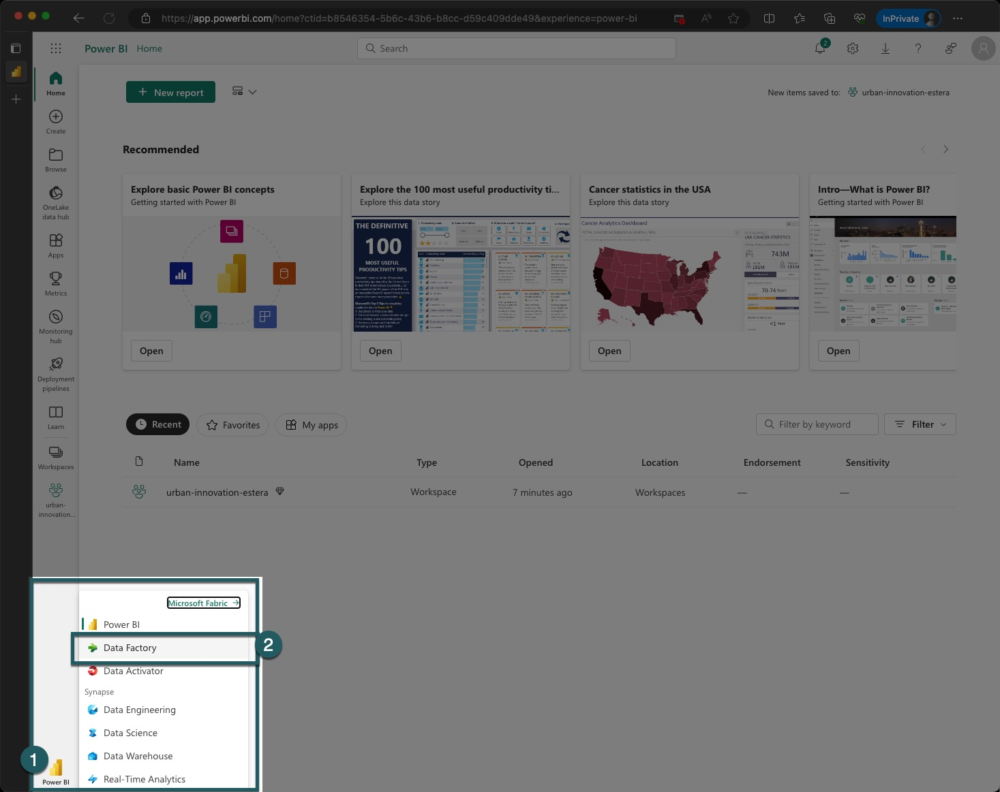

## 1.1.2. **Confirm Data Factory Access** 
Ensure you are in the Data Factory section. Begin exploring data integration at scale using data pipelines.

> [!IMPORTANT]  
> Please be aware that when accessing the data pipeline configuration pop-up, there may be a brief delay before it appears. Allow a few seconds for the pop-up window to load completely. In this window, you will have the option to specify the name of the data pipeline. It is important to avoid clicking multiple times during this delay, as this could result in the creation of multiple data pipelines inadvertently.

## 1.1.3. **Create and Name Your Data Pipeline**
Name your data pipeline, recommended to be `LoadRawTaxiData`. Select `Pipeline Activity` and then `Copy Data`.

## 1.1.4. **Edit Pipeline Elements**
Make adjustments and observe the changes in the main screen's editing area.

## 1.1.5. **Configure Data Store**
In the new tab, set the data store type to `External` and then click `New Connection`.

## 1.1.6. **Add Connection to Blob Storage**
Change the filter from `All` to `Azure` and select `Azure Blob Storage` for the new connection.

## 1.1.7. **Set Connection Details** 
   - Copy and paste the URL from the task description into the relevant field.
     - Blob Storage Account URL `https://transportationkotcorp.blob.core.windows.net/`
   - For connection type, choose `Create a new connection`.
   - Retain the automatically generated connection name or modify it if necessary.
   - Select `Shared Access Signature (SAS)` for authentication.

## 1.1.8. **Enter SAS Token**
Paste the SAS token from the description. This token grants temporary access to the blob storage, which will expire after a set duration.

SAS Token (Read Only) `sv=2022-11-02&ss=bfqt&srt=sco&sp=rwdlacupiytfx&se=2024-08-31T04:00:16Z&st=2024-03-19T20:00:16Z&spr=https&sig=Av5yc0Q3W5bSncVDP2DpfkZ5nbb%2BXj4tqjC1Chwi3Hw%3D`

## 1.1.9. **Test Connection**
Verify that the connection name is correctly displayed, then test the connection. If successful, click `Browse`.

## 1.1.10. **Navigate Blob Storage**
Browse the blob storage and select the `taxidata` folder.

## 1.1.11. **Select Data File**
Choose a specific Parquet file and click `OK`.

## 1.1.12. **File Path and Format**
Note additional elements in the file path section. Change the file format to `Parquet` and click `Preview Data`.

## 1.1.13. **Preview External Data**
Review the data preview showing the table contents from the external blob storage, then close the preview window.

## 1.1.14. **Define Data Destination**
Switch to the `Destination` tab, select `Storage Workspace`, then `Lakehouse` and click `New` to create a new Lakehouse.

## 1.1.15. **Name the Lakehouse**
Follow the naming conventions provided, input the name, and click `Create`.

## 1.1.16. **Review Lakehouse**
Verify the newly created Lakehouse is visible under the appropriate tab.

## 1.1.17. **Configure Advanced Options**
Expand the `Advanced Options` and select the desired table action, such as `Append`. Specify the table by clicking `New`.
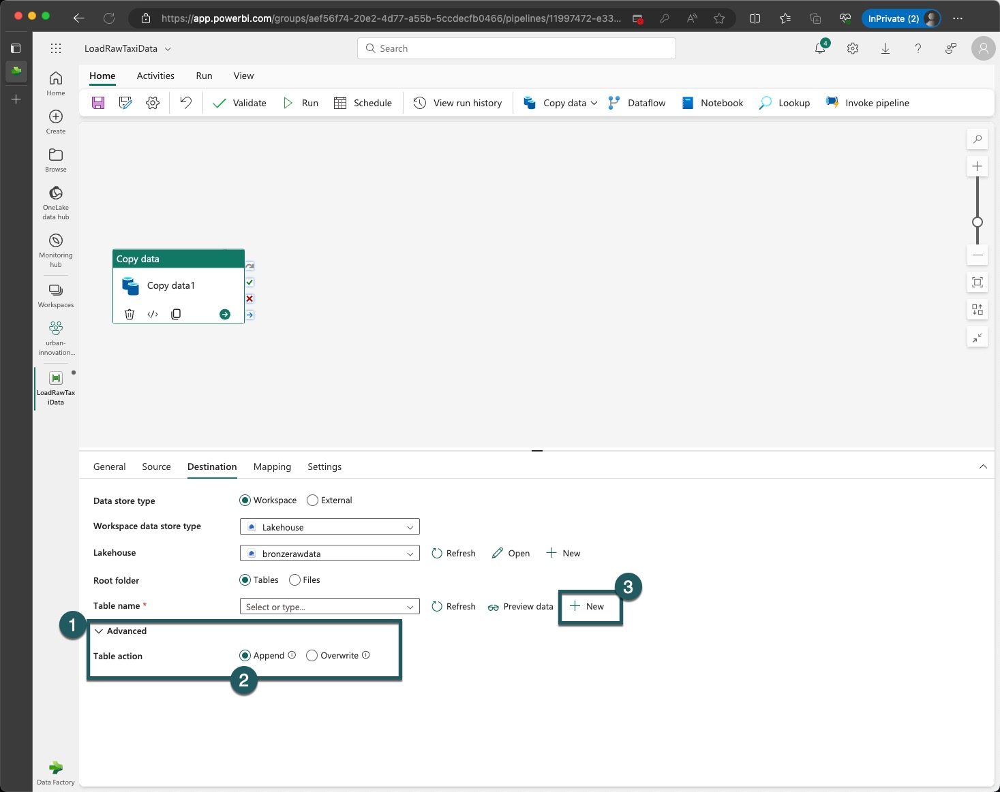

## 1.1.18. **Set Table Name**
Name the table according to the naming conventions, click `Create`, then return to the `General` tab.
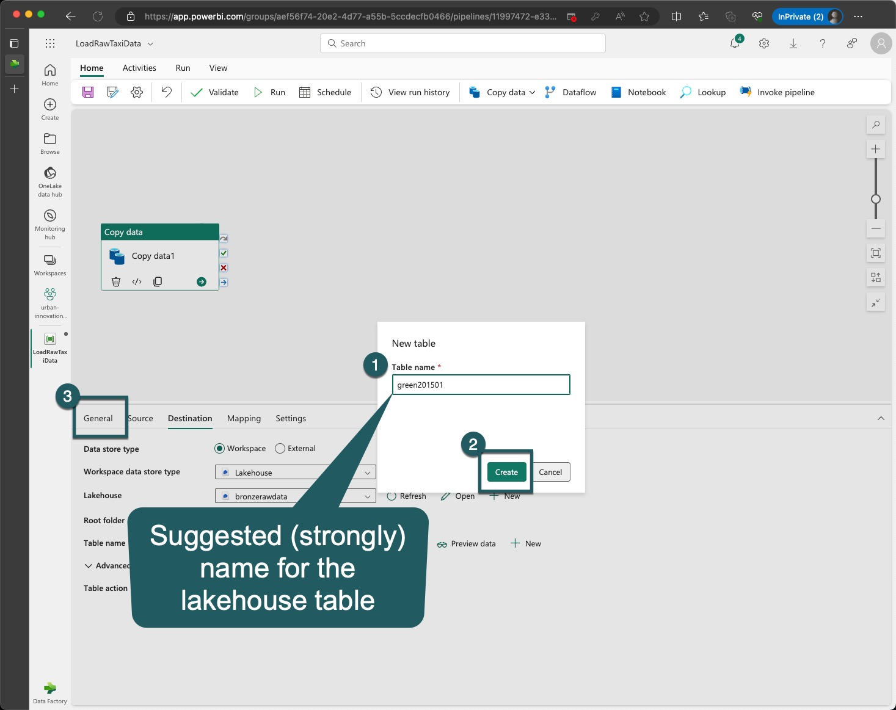

## 1.1.19. **Detail Copy Activity**
Name the copy activity to reflect its purpose, e.g., `Load NYC Taxi Green 2015 Jan`. Review and, if necessary, adjust the timeout, retry policies, and explore advanced options.

## 1.1.20. **Validate Pipeline**
Ensure the pipeline is error-free by clicking `Validate`. Once validated, close the sidebar.
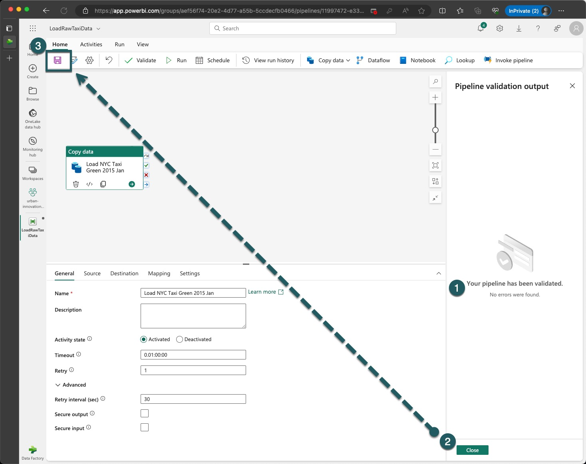

## 1.1.21. **Save and Run Pipeline**
Save your pipeline settings by clicking `Save`, then initiate the pipeline by clicking `Run`.
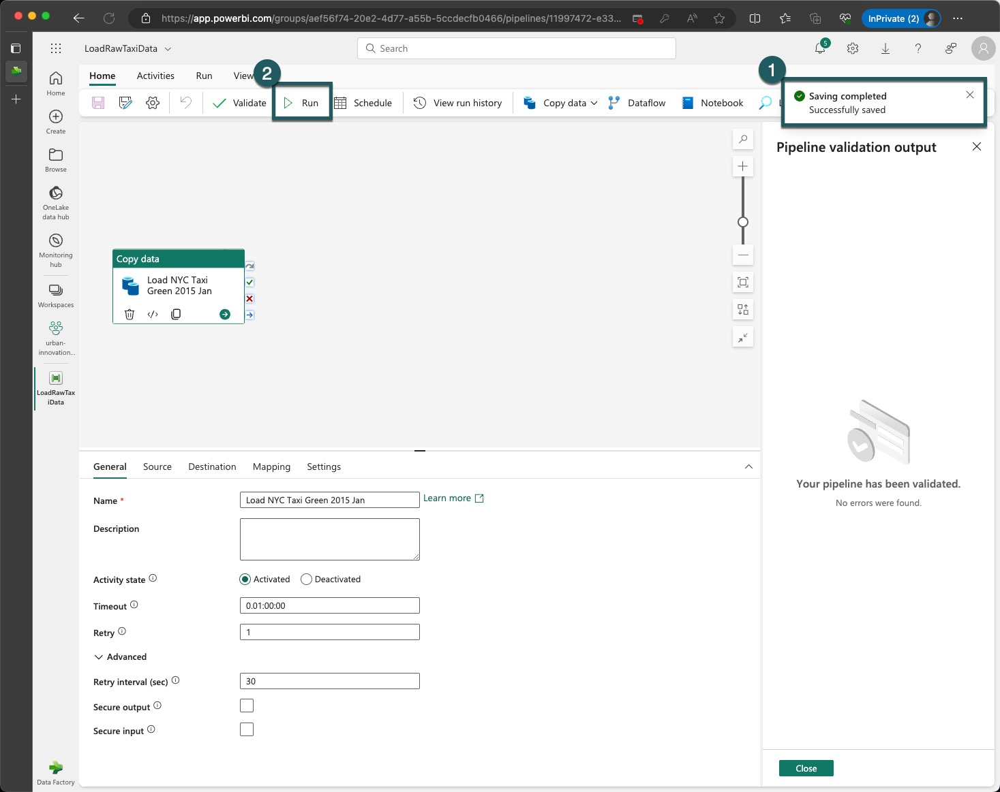

## 1.1.22. **Monitor Pipeline Execution**
Observe the notification indicating the pipeline is running, then switch to the `Output` tab.

## 1.1.23. **Confirm Pipeline Success**
Check the completion time and ensure the pipeline has succeeded. Click on the highlighted activity name for more details.

## 1.1.24. **Review Data Transfer Details**
In the sidebar, review details such as total duration and the amount of data transferred. Then navigate back to your workspace using the icon indicated as number three.

## 1.1.25. **Access Your Workspace**
In your workspace, you should find the `Load Raw Taxi Data` pipeline and the `BronzeRawData` Lakehouse. Enter the Lakehouse.

## 1.1.26. **Review Data Table**
In the `Tables` section, observe the new table and preview the data it contains.

---

# Task 1.2 Discover the Lakehouse 

> [!TIP]
> Congratulations on completing the first and most significant task (Task 1.1) of Exercise 1! 
>
> **Now, please take a moment to check your timing. If you are halfway through the allotted time for the entire Exercise 1, consider skipping Task 1.2 and proceed directly to [1.3 Create a shortcut](#task-13-create-shortcut)** as this 1.3 task is required for the  `Exercise 2 - Transform data using notebooks and Spark clusters`.
> 
> Remember, you can always return to this exercise later.

Task 1.2 Discover the Lakehouse 

Microsoft Fabric lakehouses are designed to provide data engineers and analysts with the benefits of both data lake storage and a relational data warehouse. Apache Spark is a critical technology for big data analytics, and its support within Microsoft Fabric allows you to seamlessly integrate Spark's big data processing capabilities with the other data analytics and visualization tools available on the platform. 
By using a lakehouse, you can create an end-to-end data analytics solution that includes data ingestion, transformation, modeling, and visualization. The lakehouse provides a unified and scalable platform for storing and managing data, allowing you to easily access and analyze both structured and unstructured data. Additionally, the platform's built-in security and compliance features help ensure that your data is always secure and compliant with industry standards.

**The foundation of Microsoft Fabric is a Lakehouse**, which is built on top of the **OneLake** scalable storage layer and uses **Apache Spark** and **SQL** compute engines for big data processing. A Lakehouse is a unified platform that combines:
- The flexible and scalable storage of a data lake
- The ability to query and analyze data of a data warehouse

Some benefits of a lakehouse include:
- Lakehouses use Spark and SQL engines to process large-scale data and support machine learning or predictive modeling analytics.
- Lakehouse data is organized in a schema-on-read format, which means you define the schema as needed rather than having a predefined schema.
- Lakehouses support ACID (Atomicity, Consistency, Isolation, Durability) transactions through Delta Lake formatted tables for data consistency and integrity.
- Lakehouses are a single location for data engineers, data scientists, and data analysts to access and use data.

A Lakehouse is a great option if you want a scalable analytics solution that maintains data consistency.

Imagine your company has been storing structured data from NYC Taxi's transactional system, such as trip history, passenger counts, and fare information in a data warehouse. However, you have also collected unstructured data from social media, website logs, and third-party sources related to NYC Taxi, which are difficult to manage and analyze using the existing data warehouse infrastructure.

Your company's new directive is to improve its decision-making capabilities by analyzing data in various formats across multiple sources. Therefore, the company decides to **leverage Microsoft Fabric's capabilities to analyze and manage these diverse datasets more efficiently**.

When creating shortcuts in a lakehouse, you must understand the folder structure of the item. Lakehouses are composed of two top level folders: the Tables folder and the Files folder. The Tables folder represents the managed portion of the lakehouse, while the Files folder is the unmanaged portion of the lakehouse. In the Tables folder, you can only create shortcuts at the top level. Shortcuts aren't supported in other subdirectories of the Tables folder. If the target of the shortcut contains data in the Delta\Parquet format, the lakehouse automatically synchronizes the metadata and recognizes the folder as a table. In the Files folder, there are no restrictions on where you can create shortcuts. You can create them at any level of the folder hierarchy. Table discovery doesn't happen in the Files folder.

## 1.2.1. **Lakehouse Modes Exploration**
You can work with the data in the lakehouse in two modes:

1. Lake mode enables you to add and interact with tables, files, and folders in the Lakehouse.
2. **SQL Endpoint enables you to use SQL to query the tables in the lakehouse and manage its relational data model. It allows you to run Transact-SQL statements to query, filter, aggregate, and otherwise explore data in lakehouse tables.**

Fabric's data warehouse experience allows you to transition from the lake view of the Lakehouse (which supports data engineering and Apache Spark) to the SQL experiences that a traditional data warehouse would provide.

## 1.2.2. **Explore Lakehouse Properties**
In the `Tables` section of your Lakehouse, click the three dots next to your table name and select `Properties` from the dropdown menu.

## 1.2.3. **Data Format and Management**
Observe that the table's data format is listed as `Managed`, indicating that the table is a managed entity. Also, note that this table has been optimized using Z-order optimization; further details can be found in the extra section.
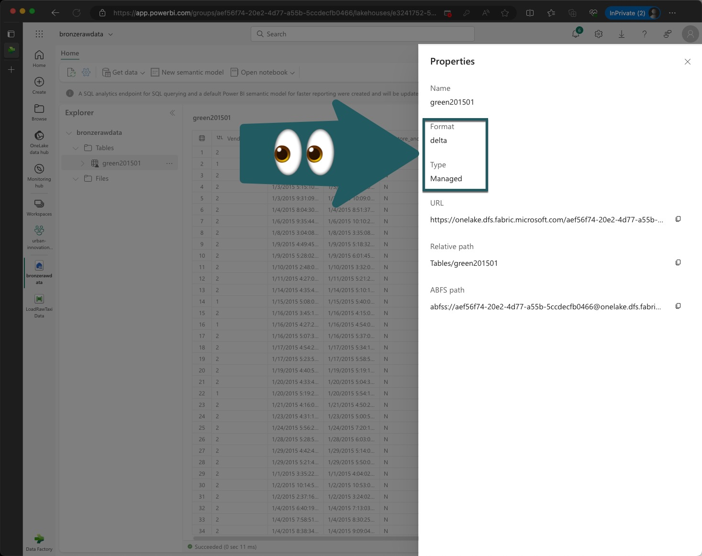

## 1.2.4. **Review Table Files**
Return to the Lakehouse overview, expand the table options, and select `Files` to examine the data. Notice that your loaded data is in Parquet format, which is now part of a Delta Lake due to the conversion process.
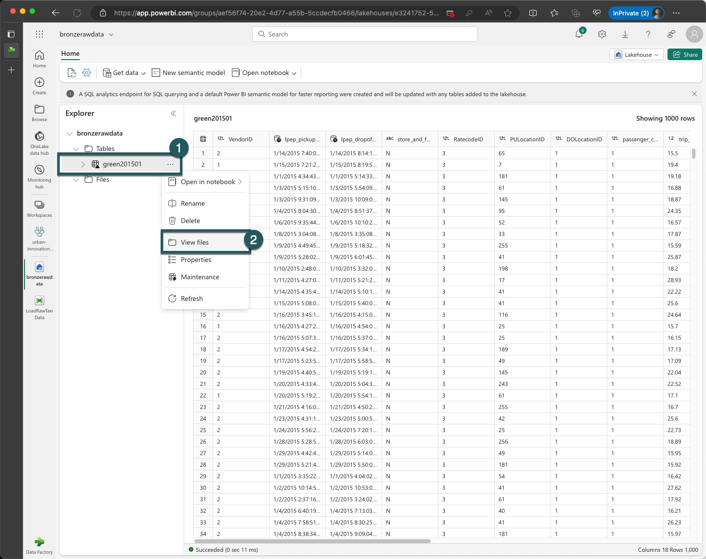

## 1.2.5. **Final Lakehouse Overview**
Navigate back to the main Lakehouse view, expand the table options for the final time, and select `Maintenance`.

## 1.2.6. **Maintenance Options and Optimization**
Here, you will find options for optimizing file size and vacuuming, which involves removing files that are no longer needed. Both processes can be automated. This section also details how Z-order optimization is applied to your data; hover over the information icon for more details.

## 1.2.7. **Completion of Task**
With the exploration of the Lakehouse's features and maintenance options, this task is now completed.

---

# Task 1.3 Create shortcut
This task focuses on accessing and leveraging tax data from the year 2023, enhancing our Lakehouse with critical financial insights without the overhead of traditional data movement.

Your mission is to access the 2023 tax data that has been accumulating since 1982, making it readily available for analysis and decision-making within our Lakehouse environment. The key here is efficiency and innovation, as we aim to streamline our data operations.

Task Details:
* In this task, you will utilize the `Shortcuts` feature, a powerful tool that enables direct access to data without the necessity of copying it into the Lakehouse. This approach not only saves time but also reduces storage costs and maintains data integrity by eliminating unnecessary duplication.
* By employing the `Shortcuts` strategy, you will achieve `Zero Data Movement`. This means you will directly point to the existing tax data from 2023, enabling real-time access and analysis without the overhead of traditional data transfer methods.

Benefits of This Approach:
* Efficiency: Access data in real-time without the delays associated with copying large datasets.
* Cost-effectiveness: Reduce storage costs by avoiding duplicate data in our Lakehouse.
* Data Integrity: Maintain a single source of truth by accessing data directly from its original location.

Remember, our team is here to guide you through every step of this process. Do not hesitate to reach out if you encounter any challenges or have questions about the `Shortcuts` feature and its implementation.

## 1.3.1. Expand File Options
Expand on the options for the file section by clicking the three dots for the `Files`. Then, select the `New Shortcut` option.
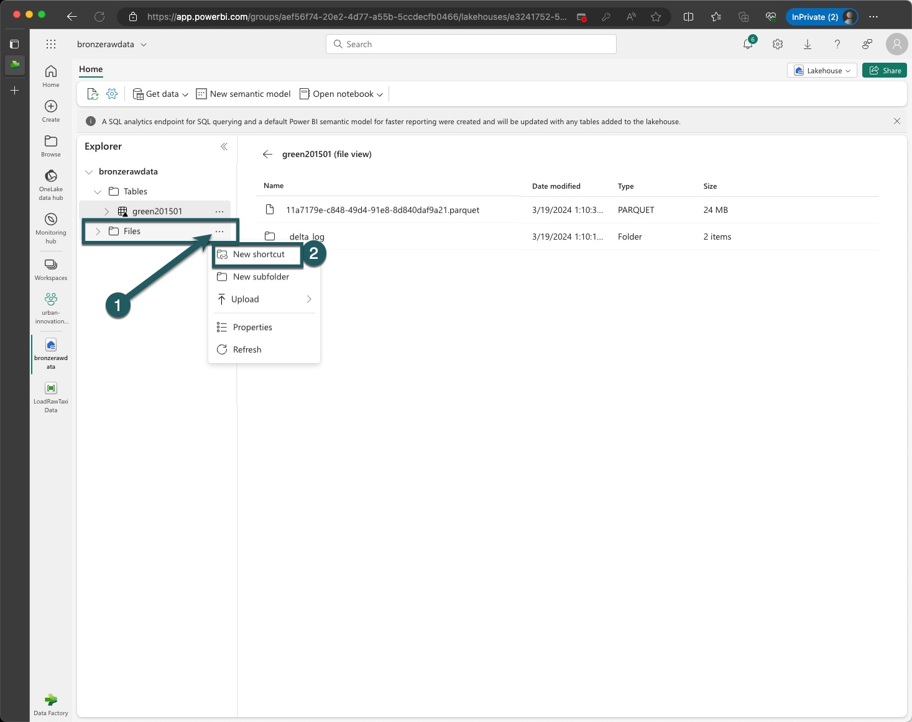

## 1.3.2. Shortcut Options
There are multiple source options available for accessing data directly without copying. Currently, shortcuts support data from OneLake, Amazon S3, Azure Data Lake Storage Gen2, and Dataverse. Select `Azure Data Lake Storage Gen2` as indicated on the screen and click `Next`.
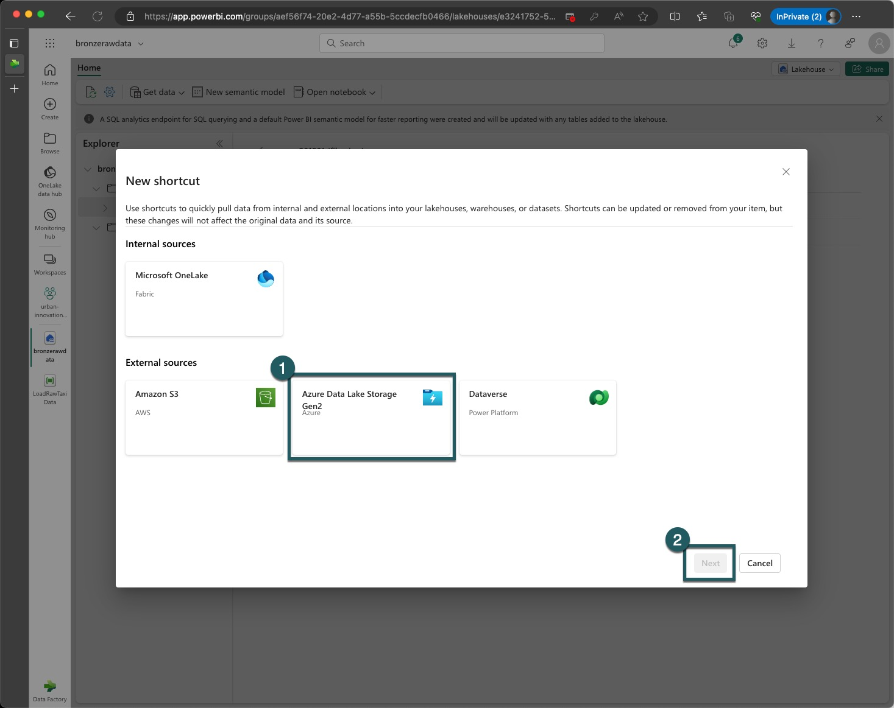

## 1.3.3. Configure New Shortcut
Provide the necessary URL by copying and pasting it from the task description. Then, choose your connection, retaining the automatically generated name if possible. For authentication, select `SAS token`, paste the provided token, and then click `Next` after filling in all details.

* Blob Storage Account URL `https://transportation23kotcorp.dfs.core.windows.net/`
* SAS Token (Read Only) `sv=2022-11-02&ss=bfqt&srt=sco&sp=rwdlacupyx&se=2024-08-31T05:45:27Z&st=2024-03-19T21:45:27Z&spr=https,http&sig=ifGqJa6706RCFaciJapwOL6vHoKzy9ltno3LznjQMkY%3D`

**If you encounter the error message `The specified connection name already exists. Try choosing a different name`, please make sure that the name you choose for the connection is unique.**

## 1.3.4. Verify ADLS Gen2 Access
Ensure correct configuration by checking the folder named `2023`. Inside it, locate a Parquet file. Confirm the selection of the appropriate folder as shown on the screen, then click `Next`.

## 1.3.5. Shortcut Configuration Success
Successfully configured access to your data via shortcuts, without needing to copy it. The shortcut should now appear under the `Files` section, indicating a link to a folder containing Parquet files.
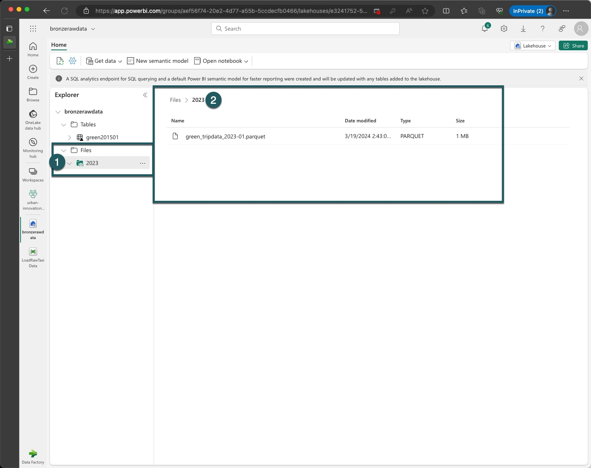

## 1.3.6. Transform Parquet Data
To transform the Parquet data into a Delta table, click the three dots next to the file name as shown on the screen, then select `Load Tables`.

## 1.3.7. Select New Table
Choose the `New Table` option as presented on the screen.

## 1.3.8. Name New Table
Name the new table following the provided naming conventions, then click `Load`.

## 1.3.9. Notification of Loading Process
Acknowledge the notification indicating that your file is currently being loaded into the table.

## 1.3.10. Refresh Lakehouse
After the loading process completes, refresh the Lakehouse by clicking the three dots next to the table and selecting `Refresh`. A new table should now be visible.

## 1.3.11. Open in Notebook
Notice that Fabric has generated a new notebook for you, containing the SQL to load your data from the newly created table. To attach the Lakehouse to the notebook, click on the arrow next to `Lake House` and select your previously created Lakehouse, `bronzerawdata`.

## 1.3.12. Verify Notebook Configuration
Following the correct execution, you should observe two tables under the `Tables` section and one folder under `Files`. Confirm everything is correct, then run the cell containing the PySpark code by clicking the run icon.

## 1.3.13. Execute Query
The query should execute within a few seconds, demonstrating the seamless integration and ease of use provided by Fabric as a true SaaS solution. Review the results displayed in the table.
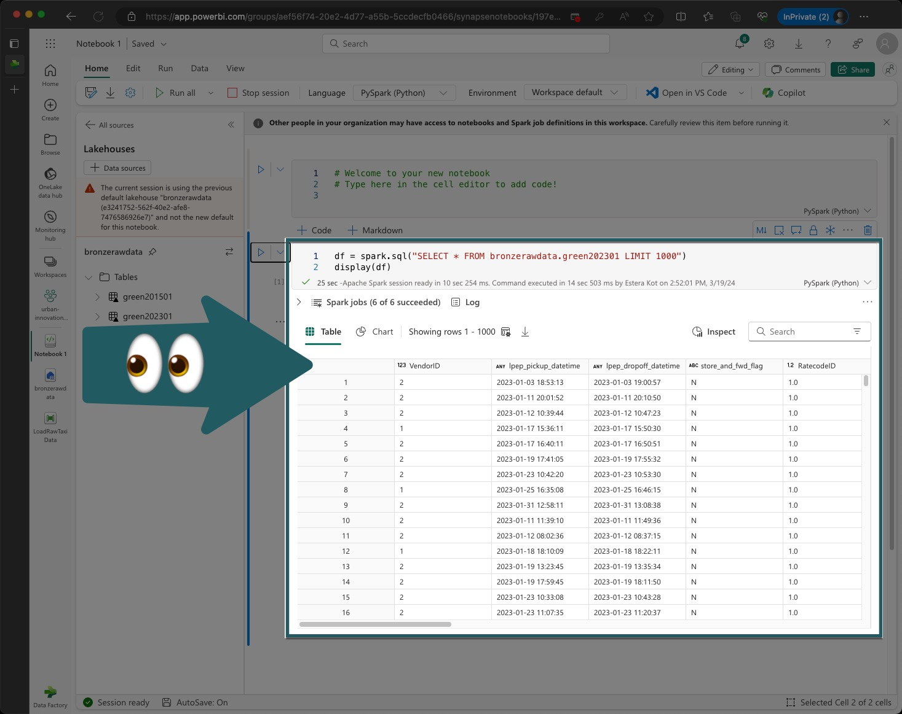

> [!WARNING]
> In Fabric, when you attach a Lakehouse to a notebook, metadata is saved in the notebook file. If you share this notebook by exporting and downloading it, the person receiving it will see a warning that it was linked to another Lakehouse. To prevent this, clear the notebook's attachments before sharing. If receiving a notebook with attachments, assign it to a new Lakehouse to avoid conflicts. 
> For CI/CD, remember that artifacts contain metadata showing their connections.
> 
> 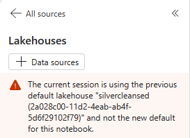 

## 1.3.14. Confirm Default Lakehouse
Ensure that the `bronzerawdata` Lakehouse is set as the default for the notebook. Once confirmed, the task is successfully completed. Congratulations!

> [!IMPORTANT]
> Once completed, go to [Exercise 2](./../exercise-2/exercise-2.md). If time permits before the next exercise begins, consider continuing with [extra steps](./../extra/extra.md).
