# Exercise 2 - Transform data using notebooks and Spark clusters 

> [!NOTE]
> Timebox: 75 minutes
> 
> Back to [Agenda](./../README.md#agenda)
> Back to [Exercise 1](./../exercise-1/exercise-1.md)

# Context
TODO

# Task 2.1 Copilot for notebooks

With Copilot for Data Science and Data Engineering, you can chat with an AI assistant that can help you handle your data analysis and visualization tasks. You can ask the Copilot questions about lakehouse tables, Power BI Datasets, or Pandas/Spark dataframes inside notebooks. Copilot answers in natural language or code snippets. Copilot can also generate data-specific code for you, depending on the task. For example, Copilot for Data Science and Data Engineering can generate code for:
* Chart creation 
* Filtering data 
* Applying transformations 
* Machine learning models


Investigate the 'green201501' table within your lakehouse, and seek insights about the dataset. Additionally, inquire how to compute the average trip distance and fare amount by each payment type.

## 1. Accessing Copilot
Select the Copilot icon found in the notebooks ribbon. This action opens the Copilot chat panel and creates a new cell at the top of your notebook. Note: This cell is essential for initializing a Spark session within a Fabric notebook and must be executed for Copilot to function correctly. Future releases may introduce alternative initialization methods.
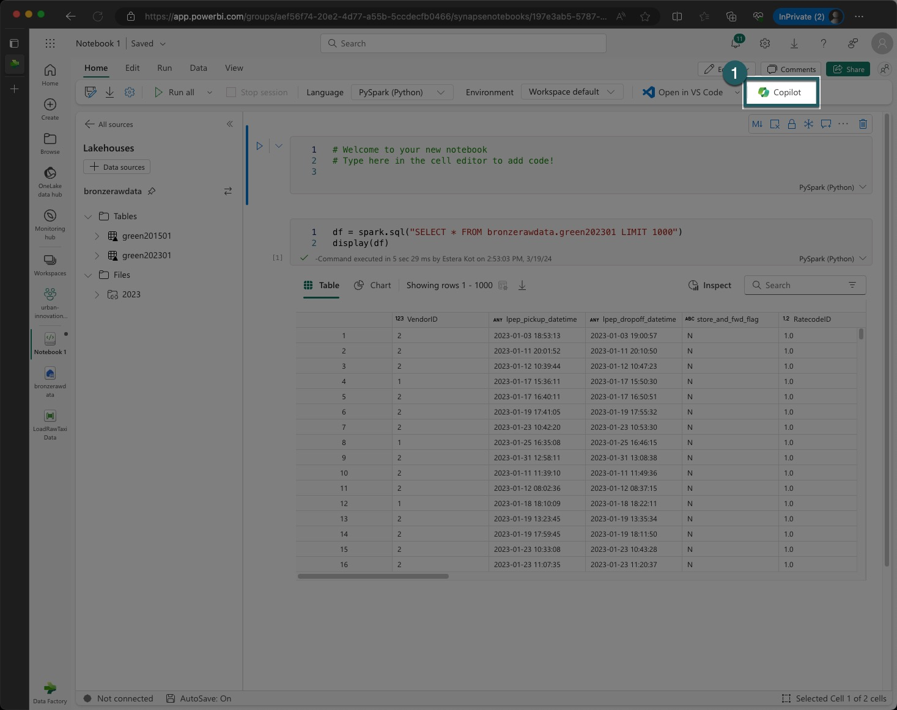

## 2. Get Started with Copilot
When the Copilot panel opens, click 'Get Started' to initiate your interaction with the AI assistant.
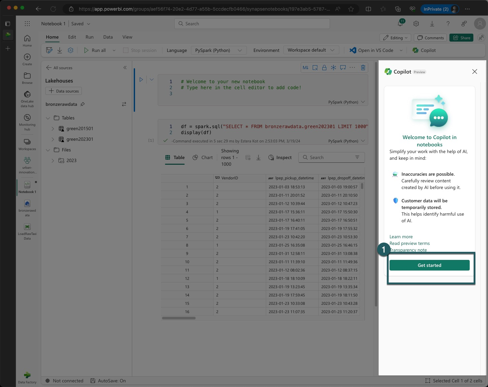

## 3. Library Installation
Copilot will automatically insert a new cell containing the necessary library installation script. Execute this cell by clicking the 'Play' button to install the required libraries for Copilot functionalities.


## 4. Data Privacy and Security Awareness
Post-installation, you will be presented with a note on data privacy and security. Please read through this to understand how your data is stored and processed. Additionally, guidelines will be provided on how to effectively communicate with Copilot.


## 5. Interacting with Copilot
Now, engage with Copilot by exploring various prompts related to your data. Feel free to ask for code snippets, clarification, or paste the generated code into a new notebook cell. This is an opportunity to explore the capabilities and assistance Copilot offers for data science and engineering tasks.

> Analyze my lakehouse table named green201501 and provide insights about the data.
> 
> Can you calculate the average trip distance and fare amount for each payment type?


This quick demonstration aims to highlight the ease of accessing Copilot for insightful data analysis.


# Task 2.2 Different ways to get data from the lakehouse

This task focuses on various methods for extracting data from the lakehouse into your notebook for analysis. Below are step-by-step instructions to perform this in your notebook.

## 1. Code Execution Basics
Remember, to execute code within a cell, use CTRL + Enter on Windows or ⌘ + Enter on MacOS. Alternatively, the 'Run' icon (▶️) next to the code cell can be used.

## 2. Extracting Data Using PySpark
Enter the following PySpark code in a new cell in your Fabric notebook. This script will retrieve data from a specified lakehouse table. Make sure to replace bronzerawdata and green202301 with your lakehouse and table names if they differ.

```pyspark
df = spark.sql("SELECT * FROM bronzerawdata.green202301 LIMIT 1000")
display(df)
```

Explanation of the Code:
`df = spark.sql("SELECT * FROM bronzerawdata.green202301 LIMIT 1000")` - This line of code uses the `spark.sql()` function to run an SQL query on a table called `green202301` located in the lakehouse `bronzerawdata`. The query selects all columns `(*)` from the table and limits the result to the first 1000 rows with the `LIMIT 1000` clause. The result of the query is then stored in a PySpark DataFrame called `df`. `display(df)` - the `display()` function is used to visualize the contents of a DataFrame in a tabular format. In this case, it visualizes the contents of the df DataFrame created in the previous line.

## 3. Using Multiple Programming Languages in Fabric Notebooks
Fabric Notebooks support various programming languages, including PySpark, Scala, SQL, and R. To switch to SQL, for example, use the %%sql magic command at the beginning of a notebook cell.

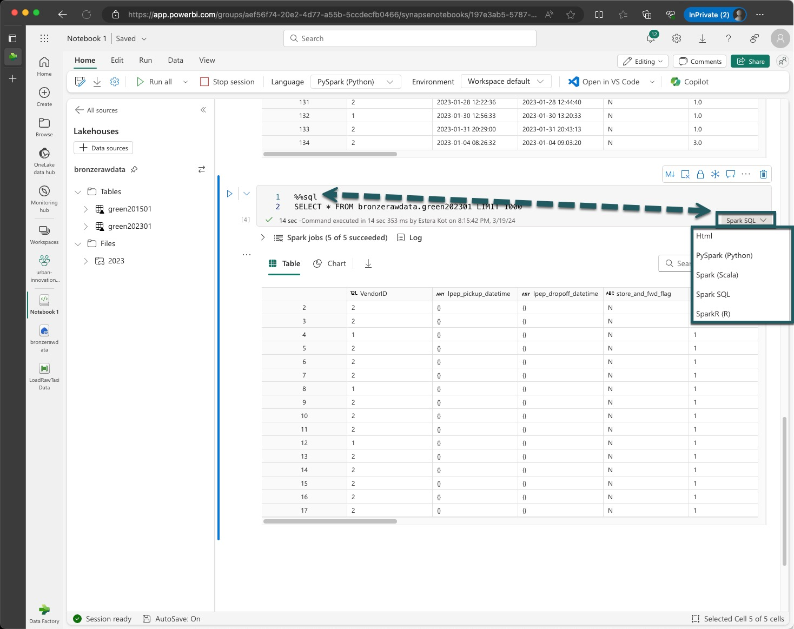

```
%%sql
SELECT * FROM bronzerawdata.green202301 LIMIT 1000
```

Now, let's execute a specific data selection command. This command filters specific columns from the DataFrame and displays the first five rows:

```df.select("VendorID", "trip_distance", "fare_amount", "tip_amount").show(5)```

The code `df.select("VendorID", "trip_distance", "fare_amount", "tip_amount").show(5)` is used to display the first five rows of a DataFrame called df, and only the columns named: "vendorID", "tripDistance", "fareAmount", "tipAmount". This is a useful function when working with large datasets to quickly inspect the data and ensure that it has been loaded correctly.


# 4. Understanding Data Workflows
When working with large datasets, starting with data retrieval sets the foundation for subsequent data analysis tasks, which may include filtering, sorting, and aggregating data. As you delve deeper, you may encounter more complex data engineering tasks such as cleansing, transformation, and aggregation, essential for advanced data analysis and insights extraction.


## Task 2.3 - Side Loading (local upload) and Load to Delta for CSV file

4. Download the file to your local machine: https://github.com/ekote/azure-architect/raw/master/part-00175-tid-4753095944193949832-fee7e113-666d-4114-9fcb-bcd3046479f3-2745-1.c000.parquet
5. Go to OneLake data hub > your Lakehouse
6. Upload the file
7. Use "Load to Table" feature


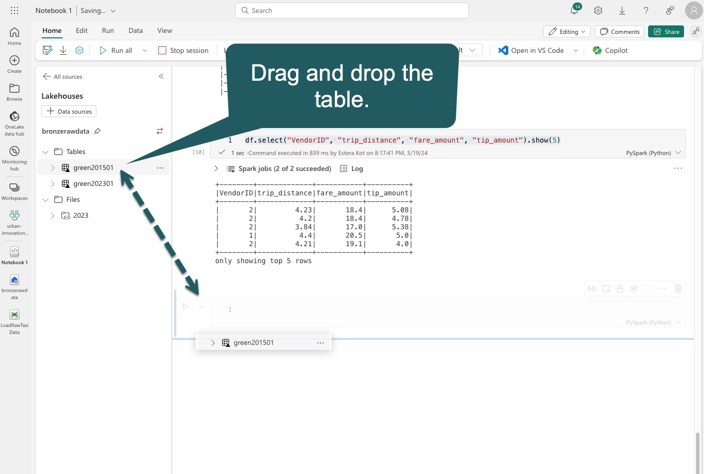


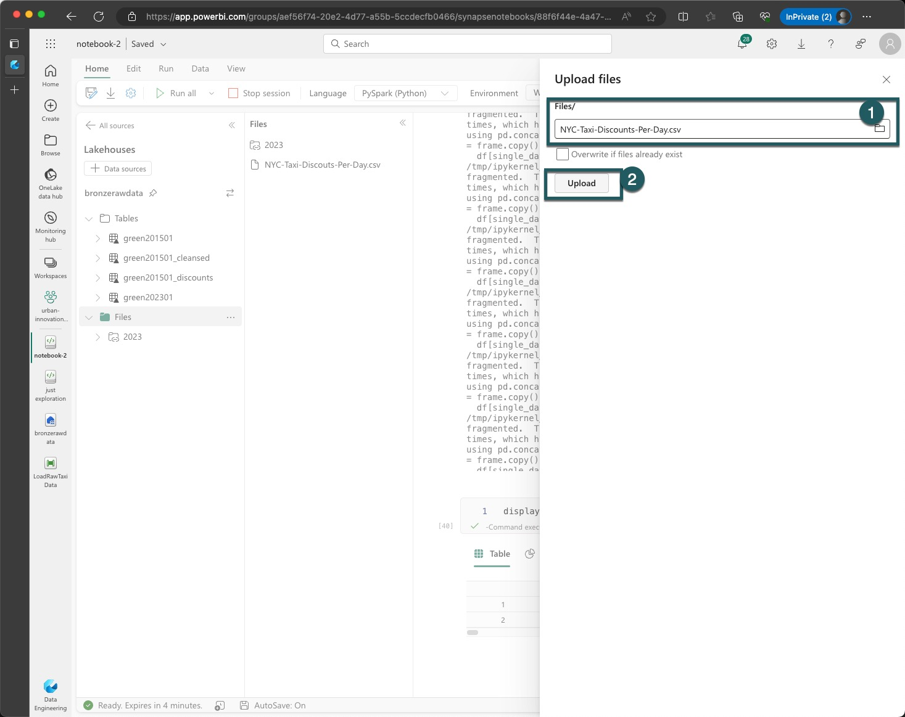


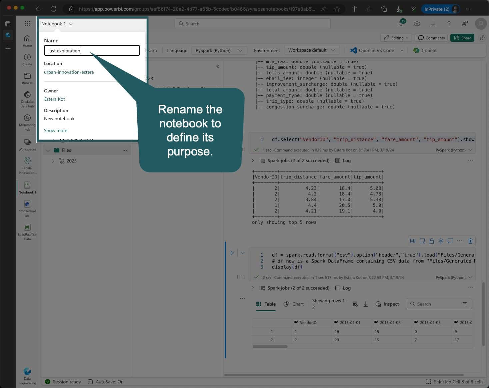


# Task 2.4 Import Notebook 
Your task is to import notebook and complete all exercises inside the notebook. 
Download notebook from the URL:


# Task 2.5 Attach the bronze Lakehouse


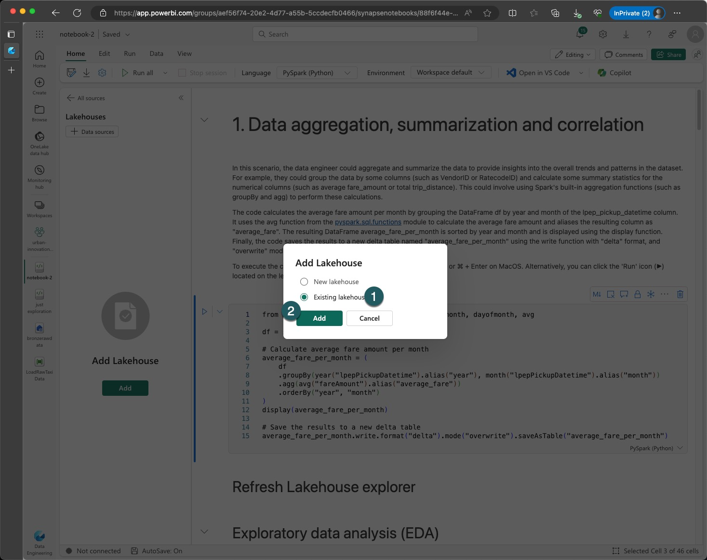


# Task 2.6 Create a silver lakehouse


# Task 2.7 - Follow the Notebook

Just read and follow all the exercises from the notebook.


# Task 2.8 - Automation 

## Before you start, do a quality check that:
1. Lakehouse `bronzerawdata` has two tables: green201501 and green202301.
2. Lakehouse `bronzerawdata` has one folder in Files section (created by the shortcut), named 2023. 
3. Lakehouse `bronzerawdata` has one file in Files section, NYC-Taxi-Discounts-Per-Day.csv
4. Lakehouse `silvercleansed` has three tables: avg_fare_per_month, green201501_cleansed, green201501_discounts.


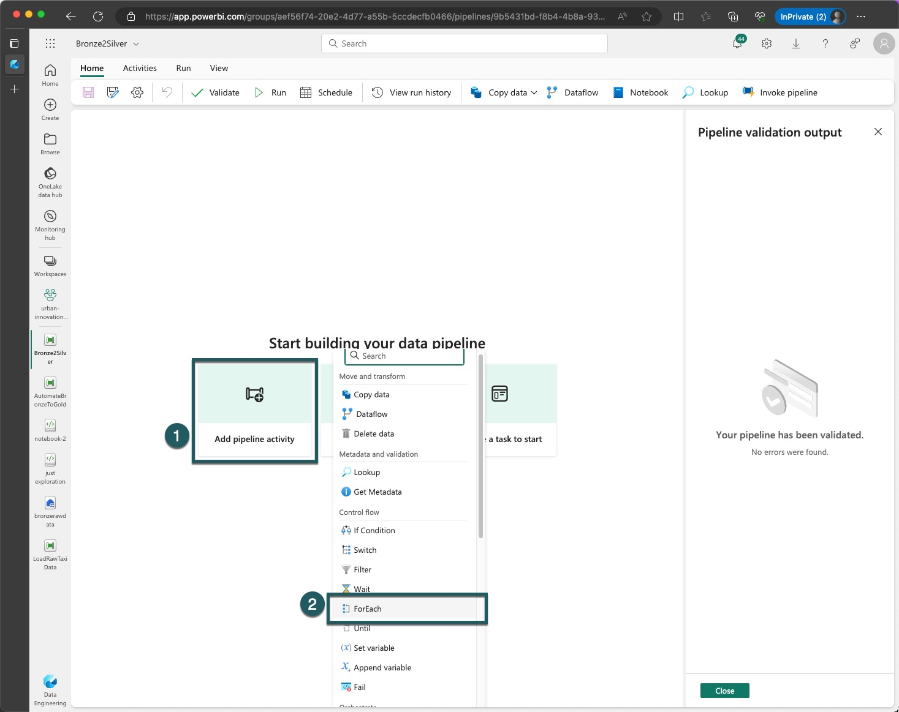


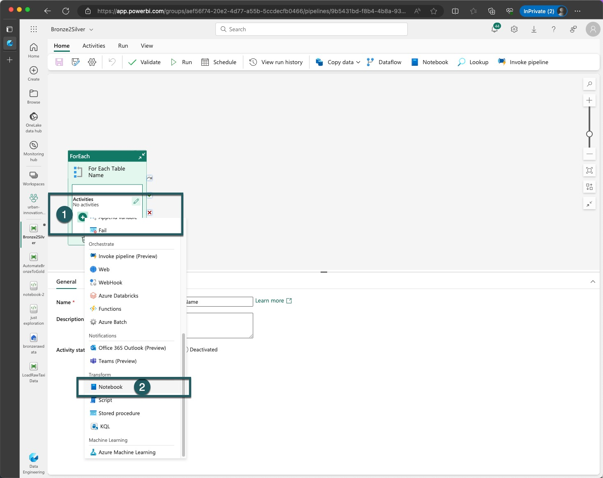

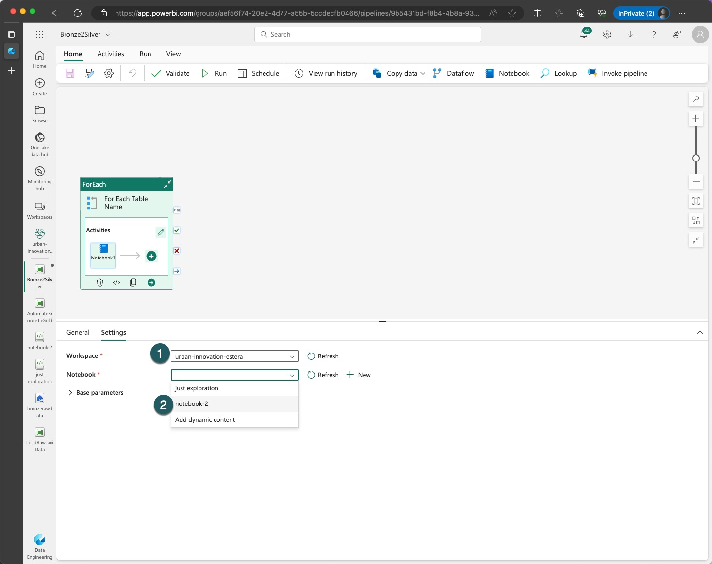


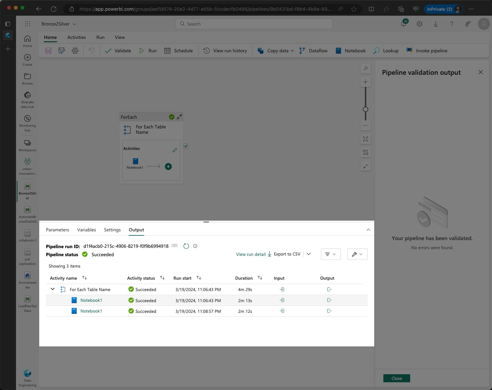

["green201501", "green202301"]


# Task 2.9 - Confirm end result
1. Lakehouse `bronzerawdata` has 
   1. two tables: green201501 and green202301. 
   2. one folder in Files section (created by the shortcut), named 2023. 
   3. one file in Files section, NYC-Taxi-Discounts-Per-Day.csv
4. Lakehouse `silvercleansed` has:
   1. six tables: avg_fare_per_month_2015_01, green201501_cleansed, green201501_discounts and avg_fare_per_month_2023_01, green202301_cleansed, green202301_discounts.


# Task 2.10 - Recharge your batteries for the next exercise!


> [!IMPORTANT]
> Once completed, go to [Exercise 3](./../exercise-3/exercise-3.md). If time permits before the next exercise begins, consider continuing with [Advanced steps](./../extra/extra.md).

