# Exercise 2 - Transform data using notebooks and Spark clusters 

> [!NOTE]
> Timebox: 75 minutes
> 
> Back to [Agenda](./../README.md#agenda)
> Back to [Exercise 1](./../exercise-1/exercise-1.md)

# Context
%TODO STORY


# Task 2.1 Copilot for notebooks

> Analyze my lakehouse table named green201501 and provide insights about the data.
> Can you calculate the average trip distance and fare amount for each payment type?


# Task 2.2 Different ways to get data from the lakehouse

To execute the cell code, use the shortcut CTRL + Enter on Windows, or ⌘ + Enter on MacOS. Alternatively, you can click the 'Run' icon (▶️) located on the left side of the code cell.

`df = spark.sql("SELECT * FROM bronzerawdata.green202301 LIMIT 1000")` - This line of code uses the `spark.sql()` function to run an SQL query on a table called `green202301` located in the lakehouse `bronzerawdata`. The query selects all columns `(*)` from the table and limits the result to the first 1000 rows with the `LIMIT 1000` clause. The result of the query is then stored in a PySpark DataFrame called `df`.
`display(df)` - the `display()` function is used to visualize the contents of a DataFrame in a tabular format. In this case, it visualizes the contents of the df DataFrame created in the previous line.

```pyspark
df = spark.sql("SELECT * FROM bronzerawdata.green202301 LIMIT 1000")
display(df)
```
Alternatively, you can use the %%sql magic in a notebook to run SQL statements.

```
%%sql
SELECT * FROM bronzerawdata.green202301 LIMIT 1000
```

The code `df.select("VendorID", "trip_distance", "fare_amount", "tip_amount").show(5)` is used to display the first five rows of a DataFrame called df, and only the columns named: "vendorID", "tripDistance", "fareAmount", "tipAmount". This is a useful function when working with large datasets to quickly inspect the data and ensure that it has been loaded correctly.

```df.select("VendorID", "trip_distance", "fare_amount", "tip_amount").show(5)```

When working with data, one of the initial tasks is to read it into the environment for analysis. Once the data is loaded, basic analysis such as filtering, sorting, and aggregating can be performed. However, as the scale and complexity of the data increase, there is a need for more advanced data engineering scenarios such as data cleansing, transformation, and aggregation. 


## Task 2.3 - Side Loading (local upload) and Load to Delta for CSV file

4. Download the file to your local machine: https://github.com/ekote/azure-architect/raw/master/part-00175-tid-4753095944193949832-fee7e113-666d-4114-9fcb-bcd3046479f3-2745-1.c000.parquet
5. Go to OneLake data hub > your Lakehouse
6. Upload the file
7. Use "Load to Table" feature


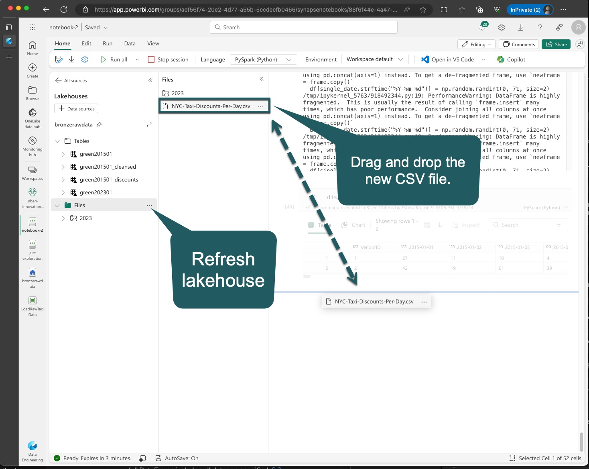

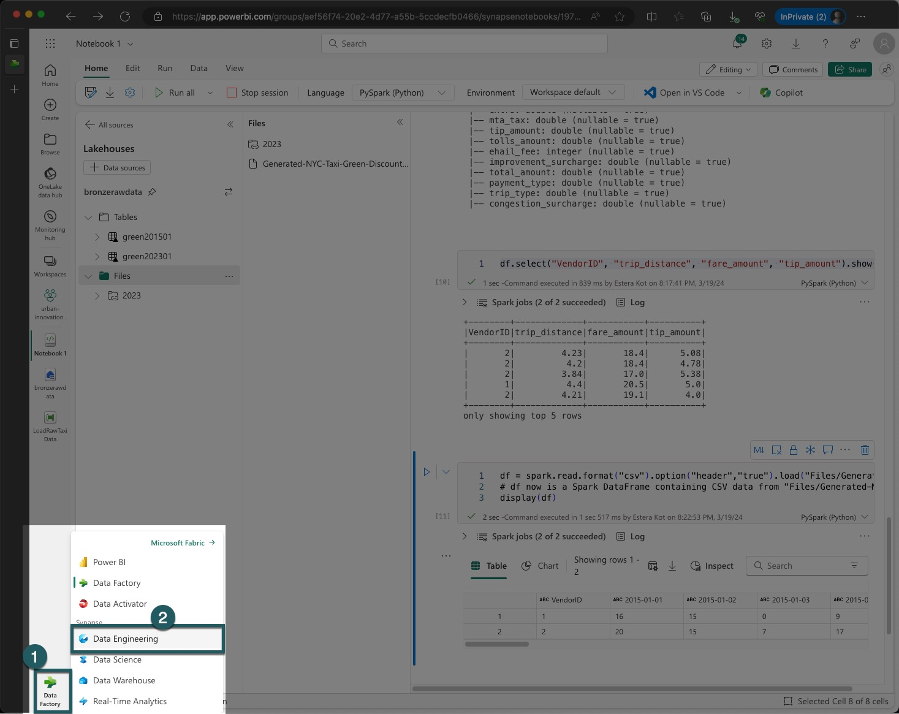

# Task 2.4 Import Notebook 
Your task is to import notebook and complete all exercises inside the notebook. 
Download notebook from the URL:

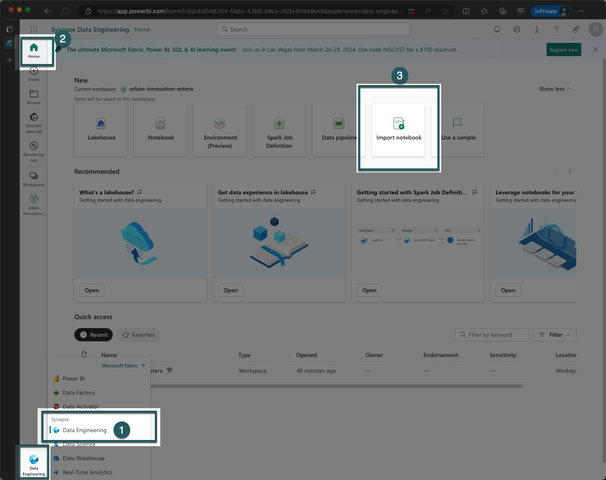

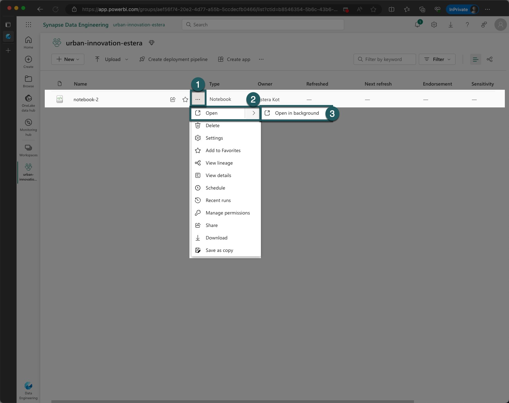


# Task 2.5 Attach the bronze Lakehouse


# Task 2.6 Create a silver lakehouse
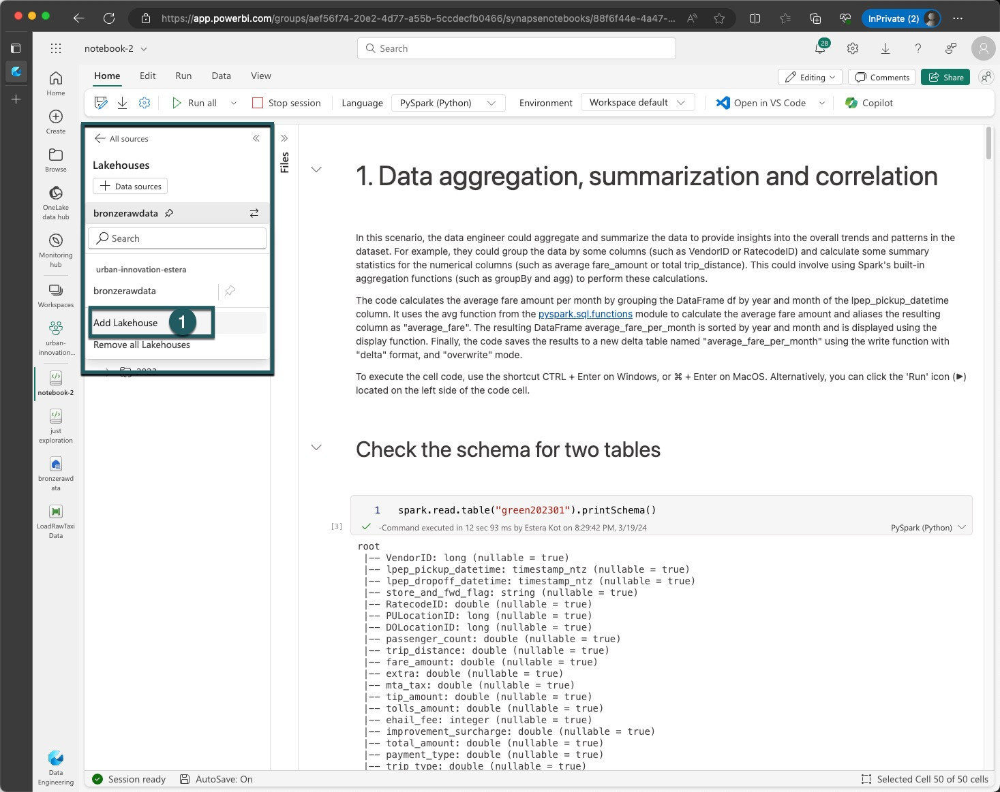
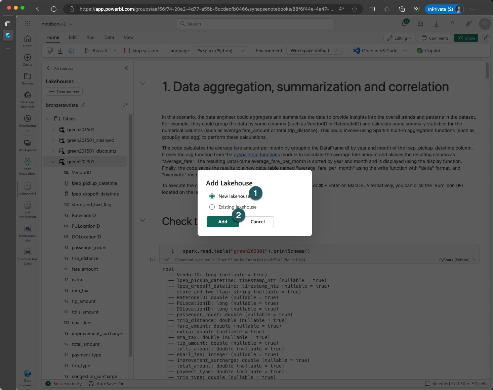


# Task 2.7 - Follow the Notebook

Just read and follow all the exercises from the notebook.


# Task 2.8 - Automation 

## Before you start, do a quality check that:
1. Lakehouse `bronzerawdata` has two tables: green201501 and green202301.
2. Lakehouse `bronzerawdata` has one folder in Files section (created by the shortcut), named 2023. 
3. Lakehouse `bronzerawdata` has one file in Files section, NYC-Taxi-Discounts-Per-Day.csv
4. Lakehouse `silvercleansed` has three tables: avg_fare_per_month, green201501_cleansed, green201501_discounts.


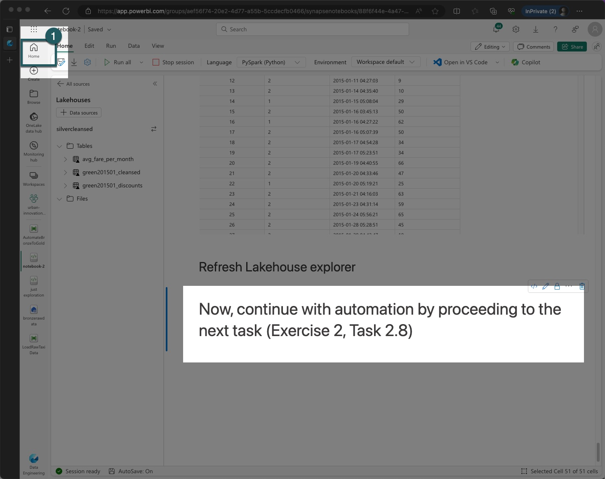


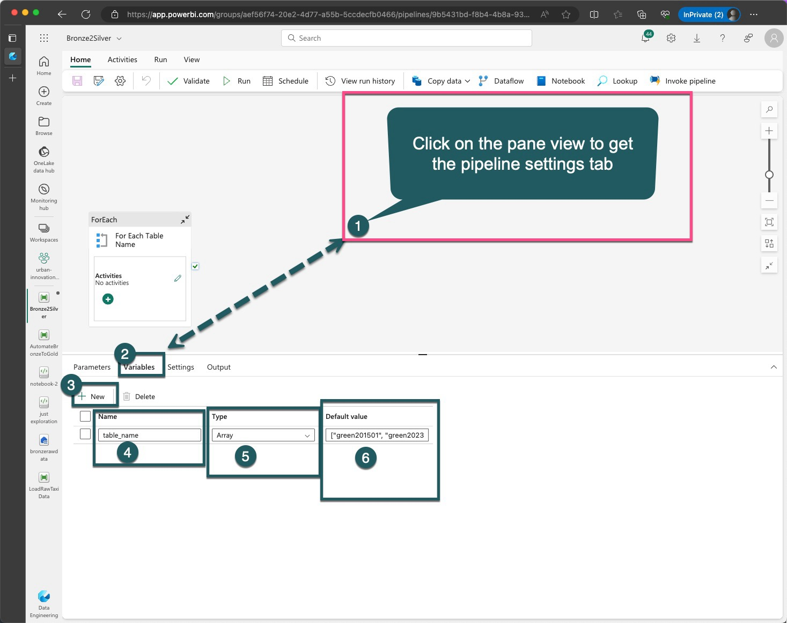


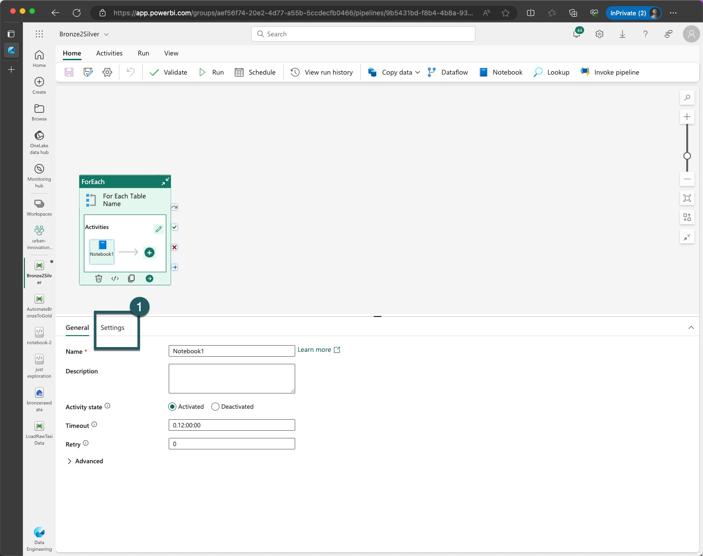

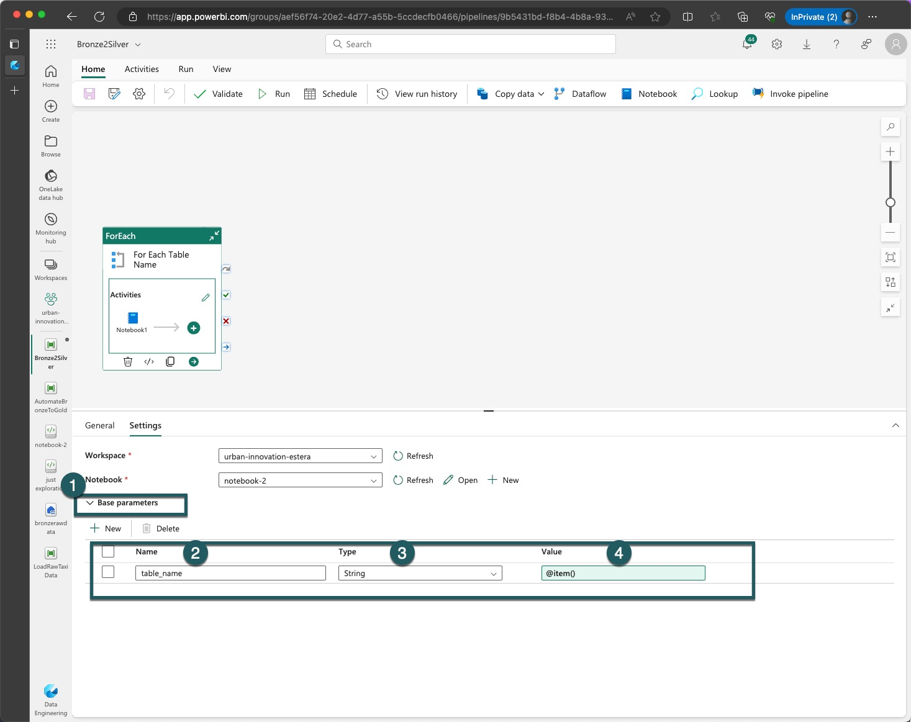


["green201501", "green202301"]


# Task 2.9 - Confirm end result
1. Lakehouse `bronzerawdata` has 
   1. two tables: green201501 and green202301. 
   2. one folder in Files section (created by the shortcut), named 2023. 
   3. one file in Files section, NYC-Taxi-Discounts-Per-Day.csv
4. Lakehouse `silvercleansed` has:
   1. six tables: avg_fare_per_month_2015_01, green201501_cleansed, green201501_discounts and avg_fare_per_month_2023_01, green202301_cleansed, green202301_discounts.

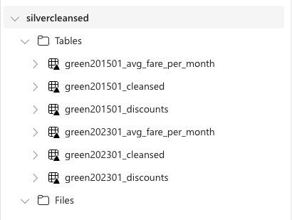


# Task 2.10 - Recharge your batteries for the next exercise!


> [!IMPORTANT]
> Once completed, go to [Exercise 3](./../exercise-3/exercise-3.md). If time permits before the next exercise begins, consider continuing with [Advanced steps](./../extra/extra.md).

