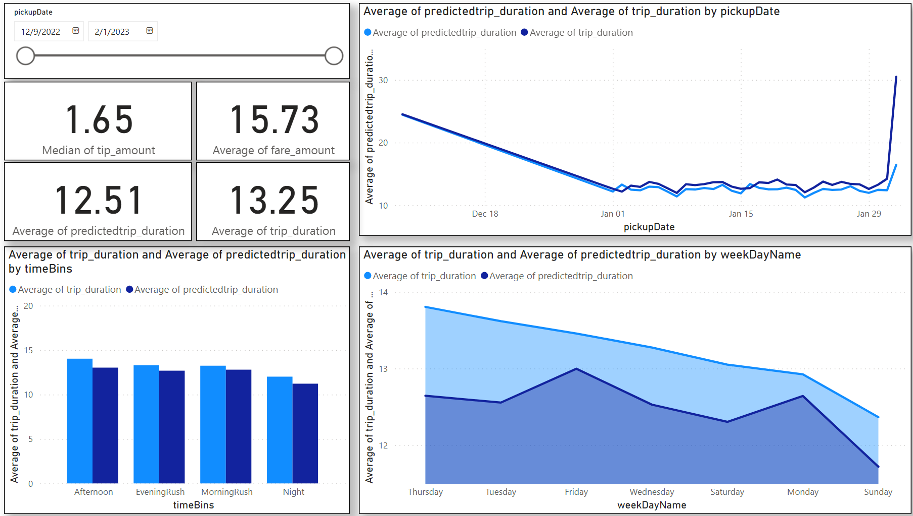
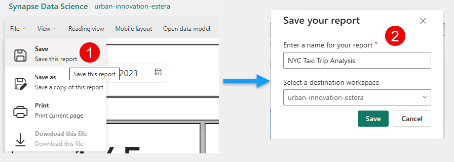
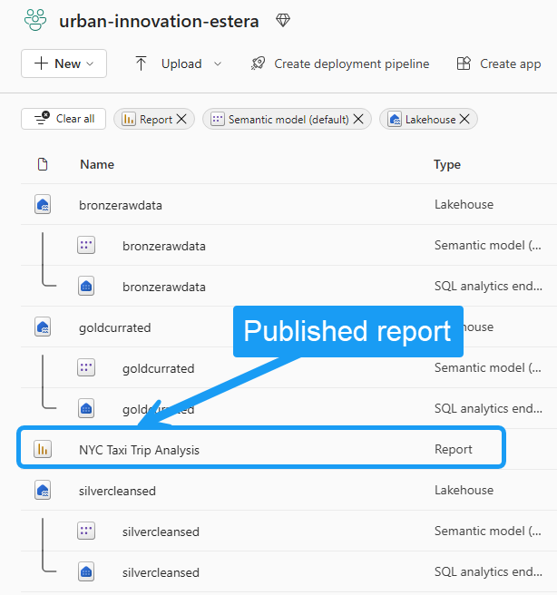

# Exercise 4 - Serve and consume data using Power BI and Data Science 

> [!NOTE]
> Timebox: 60 minutes
> 
> Back to [Agenda](./../README.md#agenda)
> Back to [Exercise 3](./../exercise-3/exercise-3.md)

# Context
The data in your lakehouse tables is included in a dataset that defines a relational model for your data. You can edit this dataset, defining custom measures, hierarchies, aggregations, and other elements of a data model. You can then use the dataset as the source for a Power BI report that enables you to visualize and analyze the data.

You can leverage the **DirectLake** feature to create Power BI datasets directly on top of your data stored in the Lakehouse. DirectLake enhances query performance when dealing with large data volumes and seamlessly integrates with Lakehouse workloads that read and write Parquet files. By combining the data visualization capabilities of Power BI with the centralized storage and tabular schema of a data lakehouse, you can implement an end-to-end analytics solution on a single platform.

**Fabric enables you to visualize** the results of a single query or your entire data warehouse, **without leaving the data warehouse experience**. Exploring data while you work to ensure you have all the necessary data and transformations for your analysis is particularly useful.

Use the **Visualize button** to create a new Power BI report from the results of your query. Creating a new report with the results of your query will open a Power BI window.

You can also use the **New report button** to create a new Power BI report from the contents of your entire data warehouse. Using the New report button opens the Power BI service experience where you can build and save your report for use by the business.

# DirectLake vs DirectQuery in Power BI

Power BI is natively integrated in the whole Fabric experience. This native integration brings a unique mode, called DirectLake, of accessing the data from the lakehouse to provide the most performant query and reporting experience. DirectLake mode is a groundbreaking new engine capability to analyze very large datasets in Power BI. The technology is based on the idea of loading parquet-formatted files directly from a data lake without having to query a data warehouse or lakehouse endpoint, and without having to import or duplicate data into a Power BI dataset. DirectLake is a fast path to load the data from the data lake straight into the Power BI engine, ready for analysis.

In traditional DirectQuery mode, the Power BI engine queries the data directly from the data source every time it's queried and hence query performance depends on the speed data can be retrieved from the data source. This method avoids having to copy the data; any changes at the source are immediately reflected in the query results while in the import mode. And yet performance is better because the data is readily available in memory without having to query the data source each time. However, the Power BI engine must first copy the data into the dataset at refresh time. Any changes at the source are only picked up during the next data refresh.

DirectLake mode now eliminates this import requirement by loading the data files directly into memory. Because there's no explicit import process, it's possible to pick up any changes at the source as they occur, thus combining the advantages of DirectQuery and import mode while avoiding their disadvantages. DirectLake mode is therefore the ideal choice for analyzing very large datasets and datasets with frequent updates at the source.

# Task 4.1 Use the Data Science experience to train a machine learning model to predict trip duration using data from Fabric lakehouse.
## Objective

In the context of this exercise, you will take the role of a data scientist who has been given the task to explore, clean and transform a dataset containing taxicab trip data, and build a machine learning model to predict trip duration at scale on a large dataset.
We will use the The New York taxi greencab dataset, which is a large-scale dataset containing taxi trips in the city from 2009 to 2018. The dataset includes various features such as pick-up and drop-off dates, times, locations, fares, payment types, and passenger counts.The dataset can be used for various purposes such as analyzing traffic patterns, demand trends, pricing strategies, and driver behavior.

**Import exercise notebook**
> You can import one or more existing notebooks from your local computer to a Fabric workspace from the Data Engineering or the Data Science homepage. Fabric notebooks recognize the standard Jupyter Notebook .ipynb files, and source files like .py, .scala, and .sql, and create new notebook items accordingly. For detailed instructions on importing a notebook, please refer to [Exercise 2 - Importing Notebooks](../exercise-2/exercise-2.md#1-importing-the-notebook)

For this task please download [Exercise 4 - Consume Data using Data Science](Exercise%204%20-%20Consume%20Data%20using%20Data%20Science.ipynb) notebook to your machine and follow the import notebook steps. Once imported please open the notebook and follow the steps outlined to completed the task.

# Task 4.2 Explore and visualize the taxi trip data and predicted trip duration from the machine learning model using a Power BI report and Direct Lake.

In this exercise, we will use Microsoft Fabric Direct Lake feature that enables direct connectivity from Semantic models to Lakehouse tables in direct query mode with automatic data refresh. In the following steps you will use the prediction data produced in the previous task  *"4.1 Use the Data Science experience to train a machine learning model"*
##### Steps to follow.

1. Navigate to the goldcurated lakehouse artifact in your workspace, that you used as part of the previous exercises and open the lakehouse UI.

2. Click on the "New semantic model" button on the top ribbon, and in the dialog box enter the name for the semantic model (NYCTaxiTrips) and select **greentaxi_predicted** and click confirm to create a new semantic model linked to the predictions data produced in exercise 4.1

3. On the semantic model UI click on the ***New report*** button on the top ribbon to open the Power BI report authoring page in a new browser window.

You can now  create various visuals as per your requirement to generate insights from the prediction dataset or follow the steps outlined below.

#### Sample Visuals to analyze predictedTripDuration.

1.  Create a Slicer visualization for pickupDate.
    - Select the slicer option from the visualizations pane and select ***pickupDate*** from the data pane and drop it on the created slicer visualization field of the date slider visual.

2. Visualize Average tripDuration and predictedTripDuration by timeBins using a clustered column chart.
    - Add a clustered column chart, add ***timeBins*** to X-axis, ***trip_duration*** and ***predictedtrip_duration* **to Y-axis and change the aggregation method to Average.

3. Visualize Average tripDuration and predictedTripDuration by weekDayName.
    - Add an area chart visual and add ***weekDayName* **onto X-axis, ***trip_duration*** to Y-axis and ***predictedTripDuration*** to secondary Y-axis. Switch aggregation method to Average for both Y-axes.

4. Add Card visuals for overall predictedTripDuration and tripDuration.
    - Add a Card Visual and add predictedTripDuration to the fields and switch aggregation method to Average.
  - Add a Card Visual and add TripDuration to the fields and switch aggregation method to Average.

5. Visualize Average tripDuration and predictedTripDuration by pickupDate using line chart.
    - Add a line chart visual and add ***pickupDate*** onto X-axis, ***tripDuration*** and ***predictedTripDuration*** to Y-axis and switch aggregation method to Average for both fields.

6. Create Card Visuals for single view of key metrics.
   - Add a Card visual and drag ***tip_amount*** to fields and switch aggregation method to median.
   - Add 2nd Card visual and drag ***fare_amount*** to fields and switch aggregation method to average.
   - Add 3rd Card visual and drag ***predictedtrip_duration*** to fields and switch aggregation method to average.
    - Add 4th Card visual and drag ***trip_duration*** to fields and switch aggregation method to average.

    You can now rearranng the layout and modify the aesthetics of the visuals as per your requirement and the report is ready to be published.

    

# Task 4.3 Publish the report and share it with other users. 
In this task, we will publish the PowerBI report created in the previous task and share it with other users from your organisation.

##### Steps to follow.
1. On the report editor page under the File menu click on
Save or Save As option to open the report save dialog box. 2. Provide a name for the report; example *NYC Taxi Trip Analysis*
3. Select a target workspace to publish the report and click Save.

4. Your Power BI report is now available as an artifact in your workspace and is ready for sharing and consumption.

    

4. To share this report with other users, you can follow these steps:
    - Open the report from the workspace, click on ‘Share’ from the top navigation bar.
    - In the ‘Send link’ dialog, you’ll have the option to copy the sharing link or share it via Outlook, PowerPoint, and Teams to people in your organization.
    - Manage permissions to the report as needed. You can allow recipients to view and interact with the report, but they won’t be able to edit it.

    For a more detailed guide on sharing, please refer to [Sharing and Collaboration](https://learn.microsoft.com/en-us/power-bi/collaborate-share/service-share-dashboards).

 

> [!IMPORTANT]
> Once completed, go to [Exercise 5](./../exercise-5/exercise-5.md). If time permits before the next exercise begins, consider continuing with [Advanced steps](./../extra/extra.md).
