# Exercise 5 - Latest Fabric Features

> [!NOTE]
> Timebox: 40 minutes
> 
> [Back to Agenda](./../README.md#agenda) | [Back to Exercise 4](./../exercise-4/exercise-4.md) | [Up next extra exercises](./../extra/extra.md)
> #### List of exercises:
> *  [Stay Updated and Bookmark Essentials](#stay-updated-and-bookmark-essentials-1)
> *  [Fabric Runtimes and Python User-defined Table Functions (UDTFs)](#fabric-runtimes-and-python-user-defined-table-functions-udtfs-1)
> *  [Managed Private Endpoints](#managed-private-endpoints-1)
> *  [Autotune Query Tuning](#autotune-query-tuning-1)
> *  [Spark vs Pandas](#spark-vs-pandas-1)
> *  [Data Wrangler is my friend](#data-wrangler-is-my-friend-1)
> *  [VSCode (WEB)](#vscode-web-1)


# Stay Updated and Bookmark Essentials
Dive into the latest and greatest from Fabric
* **Monthly Digests**: Don't miss out! Head over to the [Fabric Monthly Updates](https://blog.fabric.microsoft.com/en-us/blog/category/monthly-update) and catch up on the past three months' worth of updates. Discover the latest features and improvements rolled out each week, compiled neatly for your convenience. Bookmark this page to keep your knowledge fresh and up-to-date.
* **Latest Announcements**: Stay in the loop with the most recent news on [Fabric's Blog](https://blog.fabric.microsoft.com/en-US/blog). Here, major updates, like the management of private endpoint capabilities, are discussed in detail. It's a treasure trove of insights and announcements you won't want to miss.
* **Pin the Visualizations**: Show some love for the internal Microsoft team's creative endeavor at [Fabric Notes](https://microsoft.github.io/fabricnotes/). They've brilliantly visualized common concepts in Fabric, earning well-deserved kudos. Pin this website for a blend of inspiration and innovation.
* **Voice Your Ideas**: At Fabric, your voice matters. If there's something you'd like to see improved or introduced, express your ideas on [Fabric Ideas](https://ideas.fabric.microsoft.com/). Tailor your suggestions to specific workloads for clarity. We're all ears and ready to adapt our semester plans to meet your needs. This shift from reactive to proactive engagement empowers you to influence Fabric's future direction. An outstanding instance of this is the introduction of experimental runtimes following your feedback. So, why wait? Share your thoughts and be a part of shaping Fabric's evolution.

> [!IMPORTANT]
> This is also a great opportunity to remind you to always use the latest GA runtime version. Experiment with the Preview version, but for production-level workloads, use the GA version. Additionally, we will soon publish the lifecycle for runtimes. We aim to introduce a new release every six months, and a natural consequence for Spark is that we will have to run deprecation cycles for outdated, unsupported runtimes. Migrate your production workloads before the deprecation date because once the runtime is deprecated, there will be no way to create new pools, and your jobs will be disabled within 90 days following the deprecation.

---

# Fabric Runtimes and Python User-defined Table Functions (UDTFs)

## Understanding Apache Spark Runtimes in Fabric
Fabric Runtime, an Azure-integrated platform, is built on Apache Spark, facilitating large-scale data engineering and data science tasks. It amalgamates significant components from both proprietary and open-source domains to deliver an extensive data processing environment. Here, we refer to it as Fabric Runtime for simplicity.

Essential Components of Fabric Runtime:

- **Apache Spark**: A robust distributed computing system providing a comprehensive platform for large-scale data processing.
- **Delta Lake**: Adds ACID transactions and reliability features to Apache Spark within Fabric Runtime, enhancing data integrity.
- **Programming Language Packages**: Supports Java/Scala, Python, and R out-of-the-box for versatile development experiences.
- Based on a **solid open-source foundation**, ensuring broad compatibility and performance.

Refer to the following table for a detailed comparison of Apache Spark versions and supported configurations across different runtime versions:

| Feature              | Runtime 1.1 | Runtime 1.2 | Runtime 1.3 |
|----------------------|-----------------------------|--------------------------------|-------------------------------|
| **Apache Spark**     | 3.3.1                       | 3.4.1                          | 3.5.0                         |
| **Operating System** | Ubuntu 18.04                | Mariner 2.0                    | Mariner 2.0                   |
| **Java**             | 8                           | 11                             | 11                            |
| **Scala**            | 2.12.15                     | 2.12.17                        | 2.12.17                       |
| **Python**           | 3.10                        | 3.10                           | 3.10                          |
| **Delta Lake**       | 2.2.0                       | 2.4.0                          | 3.0.0                         |
| **R**                | 4.2.2                       | 4.2.2                          | N/A                           |

> [!TIP] 
> Explore the latest runtime version [Runtime 1.3 Details](https://learn.microsoft.com/en-us/fabric/data-engineering/runtime-1-3). Fabric Runtime 1.3, an experimental stage release, offers early access to new features and Apache Spark APIs, including the LTS version Spark 3.5.

The objective of this task is to dive into the newer runtime version, specifically to explore and utilize Python User-defined Table Functions (UDTFs) introduced in Spark 3.5. UDTFs are powerful for transforming data, particularly for expanding one row into multiple rows. Learn more about Python UDTFs [here](https://spark.apache.org/docs/latest/api/python/user_guide/sql/python_udtf.html).

## 1. Integrating Experimental Public Preview Runtime 1.3


> [!IMPORTANT]  
> To complete this exercise, you must open Fabric [using this mandatory link](https://app.fabric.microsoft.com/home?debug.enableEnvironment=1&experience=power-bi). The link contains additional flags to make the newest runtime available in that specific region. Feel free to discuss with instructors how Fabric is distributed, the various regions, and the connections between the tenant's region and the capacity region.

Switch to the experimental Runtime version 1.3 to utilize new features:

1. Navigate to the 'Workspace settings' within your Fabric workspace.
2. Access the 'Data Engineering/Science' tab and select 'Spark Settings'.
3. In the 'Environment' section, choose 'Runtime Versions', select '1.3 Experimental (Spark 3.5, Delta 3 OSS)', and confirm your changes. This sets Runtime 1.3 as your default.


## 2. Initiating a New Notebook
Create and configure a new notebook:

1. Start a new notebook session in your workspace.
2. Note that Spark 3.5 sessions may take 2-5 minutes to initiate due to the absence of starter pools in the early experimental phase.
3. Verify the Spark version by executing `sc.version` in your notebook to confirm Spark 3.5 is active.

## 3. Exploring UDTFs with Fabric
Explore the unique capabilities of UDTFs for comprehensive data transformations:
1. Consider the real-world scenario of taxi fares, where the final cost encompasses various elements beyond the base fare, such as taxes, tips, and additional charges.
2. Utilize UDTFs to calculate and apply these additional costs in one operation, enhancing data analysis and insight extraction from your datasets.
3. Apply the provided example code to a specific table from either your bronze or silver lakehouse data, focusing on the 'fare_amount' column.
4. Perform the transformations and observe the outcome on a subset of the data, applying a 5% discount as an example.

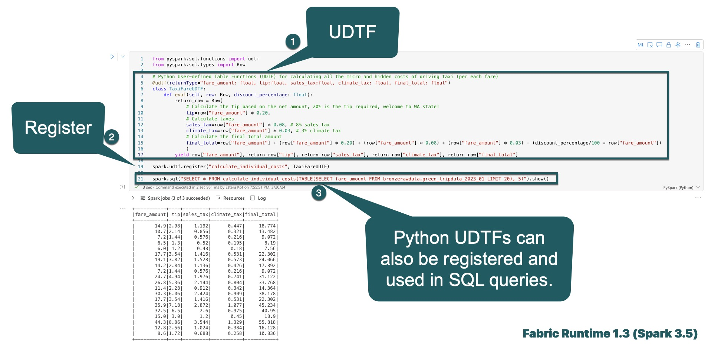

<details>

<summary>Click here to expand the details and check the code</summary>

```python
from pyspark.sql.functions import udtf
from pyspark.sql.types import Row

# Python User-defined Table Functions (UDTF) for calculating all the micro and hidden costs of driving taxi (per each fare)
@udtf(returnType="fare_amount: float, tip:float, sales_tax:float, climate_tax: float, final_total: float")
class TaxiFareUDTF:
    def eval(self, row: Row, discount_percentage: float):
        return_row = Row(
            # Calculate the tip based on the net amount, 20% is the tip required, welcome to WA state!
            tip=row["fare_amount"] * 0.20,
            # Calculate taxes
            sales_tax=row["fare_amount"] * 0.08, # 8% sales tax
            climate_tax=row["fare_amount"] * 0.03, # 3% climate tax
            # Calculate the final total amount
            final_total=row["fare_amount"] + (row["fare_amount"] * 0.20) + (row["fare_amount"] * 0.08) + (row["fare_amount"] * 0.03) - (discount_percentage/100 * row["fare_amount"])
            )
        yield row["fare_amount"], return_row["tip"], return_row["sales_tax"], return_row["climate_tax"], return_row["final_total"]


# Python UDTFs can also be registered and used in SQL queries.        
spark.udtf.register("calculate_individual_costs", TaxiFareUDTF)

# Python UDTFs can also take a TABLE as input argument, and it can be used in conjunction with scalar input arguments. By default, you are allowed to have only one TABLE argument as input, primarily for performance reasons. If you need to have more than one TABLE input argument, you can enable this by setting the spark.sql.tvf.allowMultipleTableArguments.enabled configuration to true.
spark.sql("SELECT * FROM calculate_individual_costs(TABLE(SELECT fare_amount FROM bronzerawdata.green_tripdata_2023_01 LIMIT 20), 5)").show()
```

</details>

Each new Runtime version introduces an expanded API, new methods, and transformations, enhancing the efficiency and capabilities of data processing. Moreover, the latest GA runtime versions typically outperform their predecessors due to continuous improvements by both the open-source community and the Microsoft product groups.

Now, apply this knowledge to calculate comprehensive costs beyond the example. 

---

# Managed Private Endpoints

Managed virtual networks are virtual networks that are created and managed by Microsoft Fabric for each Fabric workspace. Managed virtual networks provide network isolation for Fabric Spark workloads, meaning that the compute clusters are deployed in a dedicated network and are no longer part of the shared virtual network. Managed virtual networks also enable network security features such as managed private endpoints, and private link support for Data Engineering and Data Science items in Microsoft Fabric that use Apache Spark.

> [!IMPORTANT]
> Managed private endpoints (and Workspace identities) are only available for workspaces assigned to Fabric capacities with SKU's F64 or larger. 


Managed private endpoints are added to a workspace. Workspace admins can create and delete managed private endpoint connections from the workspace settings of a Fabric Workspace.


Managed private endpoints are connections that workspace admins can create to access data sources that are behind a firewall or that are blocked from accessing from the public internet. Managed private endpoints allow Fabric Spark workloads to securely access data sources without exposing them to the public network or requiring complex network configurations. The private endpoints provide a secure way to connect and access the data from these data sources using items such as notebooks and Spark job definitions.

Microsoft Fabric creates and manages managed private endpoints based on the inputs from the workspace admin. Workspace admins can set up managed private endpoints from the workspace settings by specifying the resource ID of the data source, identifying the target subresource, and providing a justification for the private endpoint request. Managed private endpoints support various data sources, such as Azure Storage, Azure SQL Database and many more.

Follow the GIF which presents e2e demo on how to create manage private endpoint.


---

# Autotune Query Tuning
When discussing Spark runtimes, we inevitably address the crucial topic of performance, which concerns us all. In response to this, we have developed 'Autotune', a feature designed to optimize Spark settings for your jobs, enhancing efficiency and effectiveness.

This week marks the transition of Autotune to public review, accessible across all regions. This presents you with a unique opportunity to view a demonstration that has yet to be released to the public. Below, you will find a link to this exclusive demo.

Please look out for further announcements regarding Autotune throughout the week. We are excited to share more information about this innovative feature with you.

* [Watch the exclusive demo](https://1drv.ms/v/s!ApCaji7rcQaQ3rNv8g7pBnLdrwQBfQ?e=R7GiEq) that has not been yet released.

* For more information on Autotune, please review the documentation available at [Autotune in Fabric Data Engineering](https://learn.microsoft.com/en-us/fabric/data-engineering/autotune?tabs=sparksql).

> [!TIP]
> Autotune query tuning examines individual queries and builds a distinct ML model for each query. It specifically targets:
> - Repetitive queries
> - Long-running queries (those with more than 15 seconds of execution)
> - Spark SQL queries (excluding those written in the RDD API, which are very rare)
>
> This feature is compatible with notebooks, Spark Job Definitions, and pipelines.

---

# Spark vs Pandas
Your mission, in that task, involves guiding new team members through the labyrinth of big data processing, particularly in leveraging Apache Spark over Pandas for substantial datasets. This advice is pivotal not only within the Fabric ecosystem but universally in the big data domain.

## Understanding Pandas
Pandas shines due to its simplicity and intuitive design, making it a favorite among data engineers, scientists, and analysts. However, its primary limitation lies in its inability to natively harness parallel architectures and computations. Pandas operates within the confines of single-node, in-memory computations, restricting its scalability and efficiency in processing vast datasets typical in big data scenarios.

## Transition to Spark and its core concepts
Apache Spark transcends these limitations by adopting a distributed computing approach. Key distinctions include:
- **Spark DataFrames**: These are distributed across clusters, enabling parallel data processing far beyond the capacities of a single machine.
- **Lazy Evaluation**: Spark employs lazy evaluation for DataFrames, constructing a Directed Acyclic Graph (DAG) of transformations that are optimized and executed only when an action is required, enhancing overall execution efficiency.
- **Advanced Optimizations**: Features like Adaptive Query Execution (AQE) and Dynamic Partition Pruning (DPP) automatically optimize query plans and data partitioning, respectively, something far beyond the reach of Pandas.

## General rule of thumb
- Utilize Pandas for datasets that comfortably fit into the memory of a single machine and when the data processing doesn't demand extensive parallelization.
- Opt for Spark when dealing with massive datasets that exceed single machine capacity, or when tasks benefit significantly from parallelization, despite any existing familiarity with Pandas due to Spark's scalability and optimization features.

## Bridging the gap with Koalas
Introduced in Spark 3.2, Koalas marries the simplicity of the Pandas API with Spark’s distributed computing prowess. By importing `pandas` API through PySpark:

```python
from pyspark import pandas as pd
```

This integration enables data practitioners to apply familiar Pandas-like operations while leveraging Spark's distributed architecture, achieving the best of both worlds.

## Practical application in Fabric:
In Fabric, data loading practices vary between Pandas and Spark. Below is an example demonstrating how to load a CSV file into both frameworks. This comparison not only highlights syntax differences but also emphasizes when to employ each framework based on dataset size and computational needs.

Chech [How to read and write data with Pandas in Microsoft Fabric](https://learn.microsoft.com/en-us/fabric/data-science/read-write-pandas).

---

# Data Wrangler is my friend
Immerse yourself in the world of efficient data analysis with Fabric's Data Wrangler. This task is designed to help you leverage Data Wrangler's capabilities to explore and transform Pandas DataFrames effectively. Data Wrangler blends a user-friendly grid-like interface with dynamic data analysis tools, making exploratory data analysis both intuitive and robust.

Dive deep into the functionalities of Data Wrangler within Fabric, focusing specifically on Pandas DataFrames. Your task will be segmented into actionable steps, guiding you through the process of data exploration, visualization, and transformation within this powerful tool.


## Initial Setup
Open your Fabric environment and navigate to the Data Wrangler tool within your notebook.
Load a Pandas DataFrame that you wish to analyze. If you don't have a specific dataset in mind, utilize a sample dataset provided within the platform.

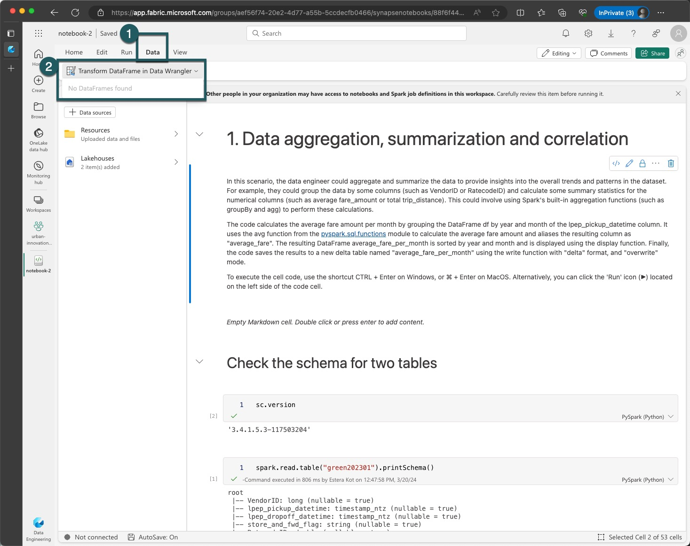
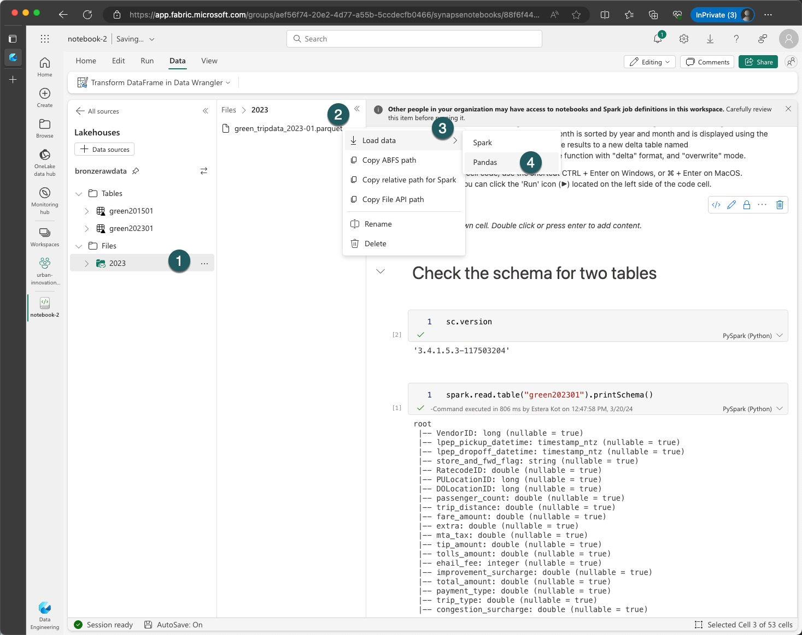
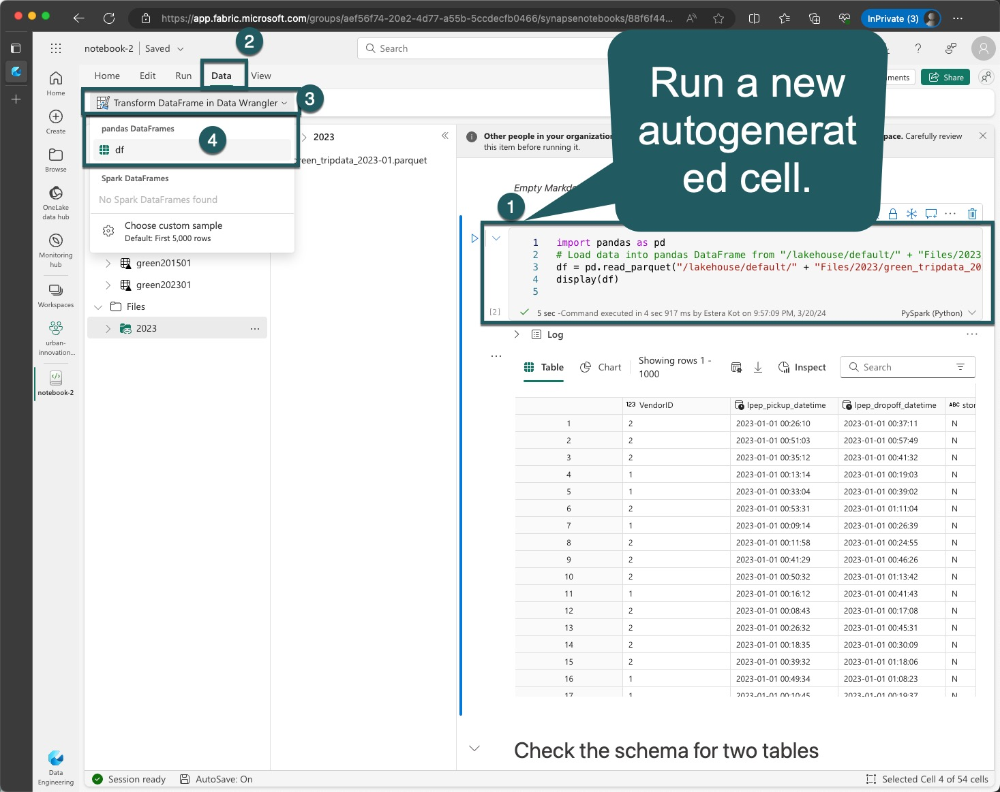
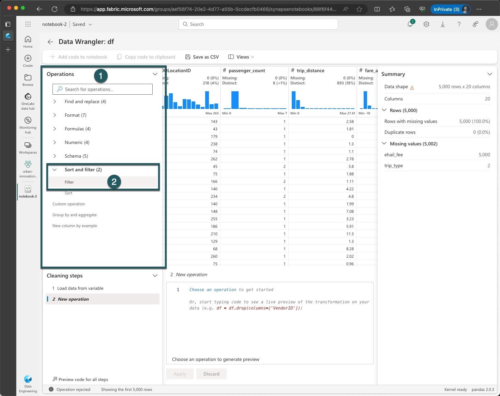

## Exploratory Data Analysis

Utilize the grid-like data display to review your dataset. Pay attention to the distribution of data, missing values, and data types.
Generate dynamic summary statistics to gain quick insights into the mean, median, mode, min, and max of your data columns.
Leverage built-in visualizations to understand data distributions, correlations, and outliers. Experiment with different chart types to best represent your data.

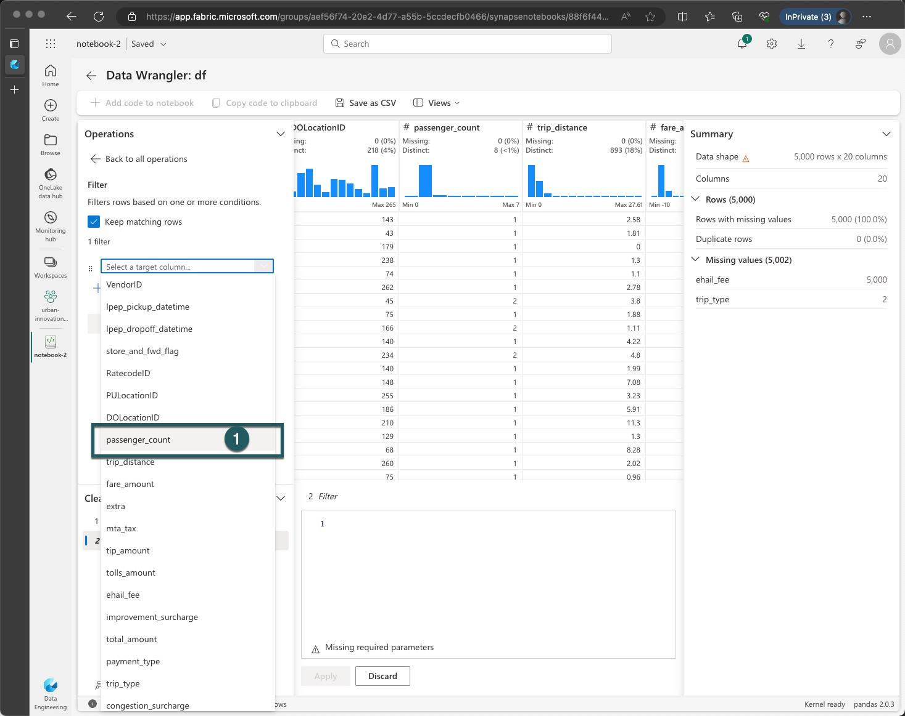
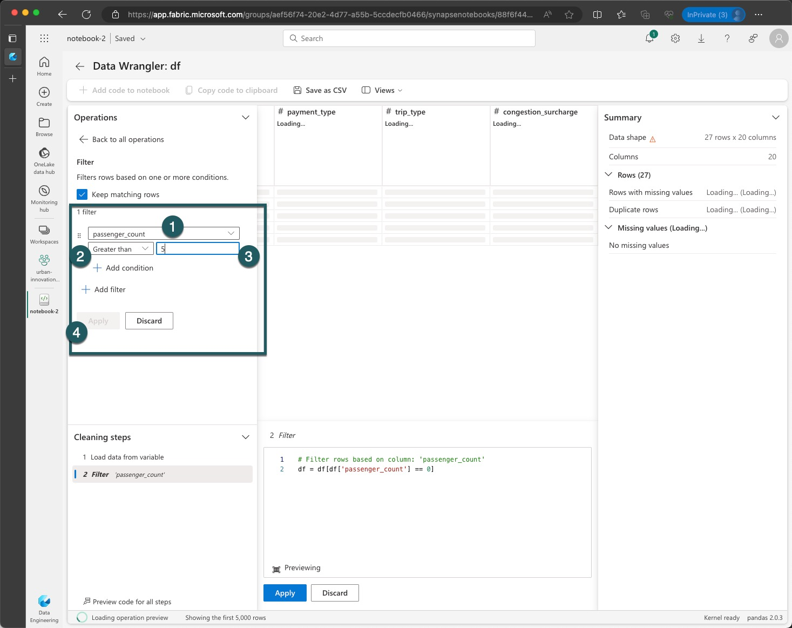


## Data Cleaning Operations

Identify any inconsistencies, missing values, or outliers within your dataset.
Apply common data-cleaning operations available in Data Wrangler, such as filling missing values, filtering rows, or correcting data types. Observe how each operation updates the data display in real time.
Evaluate the impact of your data transformations on the summary statistics and visualizations to ensure they align with your analysis goals.

## Code Generation and Reusability

As you apply transformations within Data Wrangler, observe the automatic generation of corresponding code in either Pandas or PySpark.
Save the generated code back to your notebook as a reusable function. This practice not only enhances your understanding of data transformations but also builds a library of custom functions for future analysis.

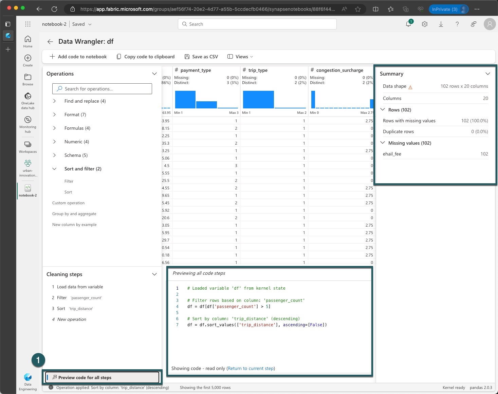

## To learn more, I encourage you to watch the Fabric Espresso episode about Data Wrangler.
[](https://www.youtube.com/watch?v=-g6KveKQXu4)


---

# VSCode (WEB)

Visual Studio Code for the Web provides a free, zero-install Microsoft Visual Studio Code experience running entirely in your browser, allowing you to quickly and safely browse source code repositories and make lightweight code changes. 

## Install the Synapse VS Code extension for the Web

1. Go to https://insider.vscode.dev from your browser.
1. Select the **Extensions** icon in the left navigation bar.
1. Search for **Synapse** and select the **Synapse VS Code - Remotes** extension
1. click **Install**.

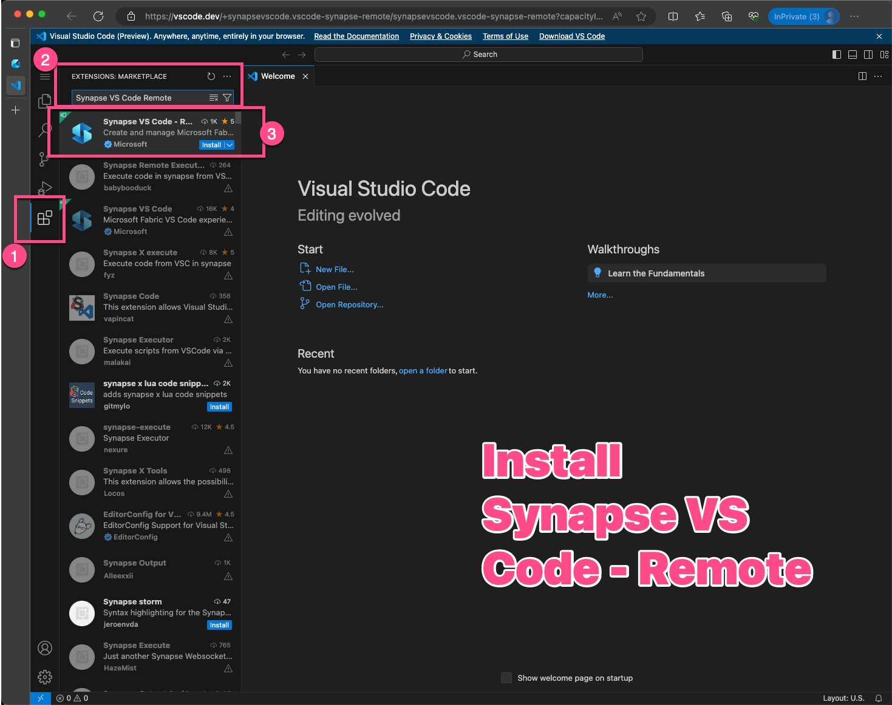


## Open a notebook (e.g., notebook-2) with the Synapse VS Code extension for the Web

You can open a notebook in the VS Code for the Web experience by clicking the **Open in VS Code(Web)** button on the notebook authoring page in the Fabric portal. After you select the button, a separate browser tab is opened with the VS Code for the web experience. If you haven't already installed the extension, it is automatically installed, and activated, and the notebook is opened.


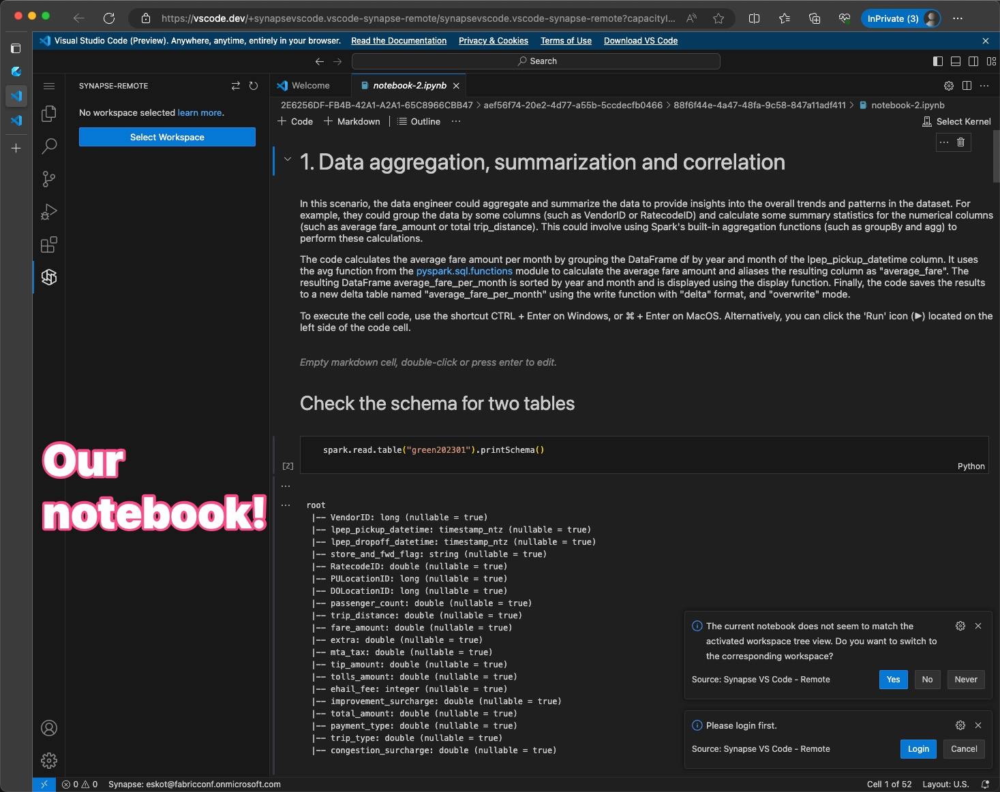


## Run notebooks in the VS Code for the Web experience

You can run a notebook in the VS Code for the web experience by selecting the **Run** button in the notebook editor. Before you run the notebook, make sure to select the **Synapse VS Code -Remote** as the kernel. The kernel is selected in the top right corner of the notebook editor.

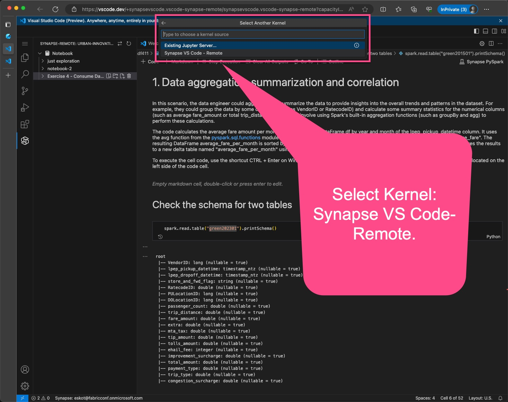


## To learn more, I encourage you to watch the Fabric Espresso episode about VSCode.

[](https://www.youtube.com/watch?v=A9SjAyZ_JSc)


---
> [!IMPORTANT]
> Once completed, go to [Agenda](./../README.md#agenda). If time permits before the next exercise begins, consider continuing with [extra steps](./../extra/extra.md).