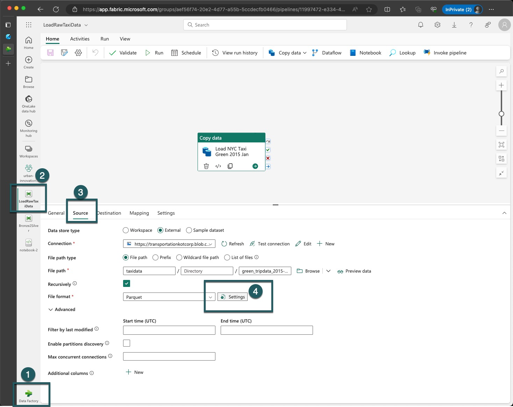
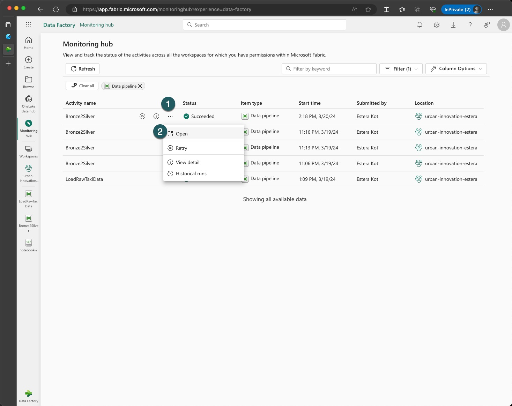
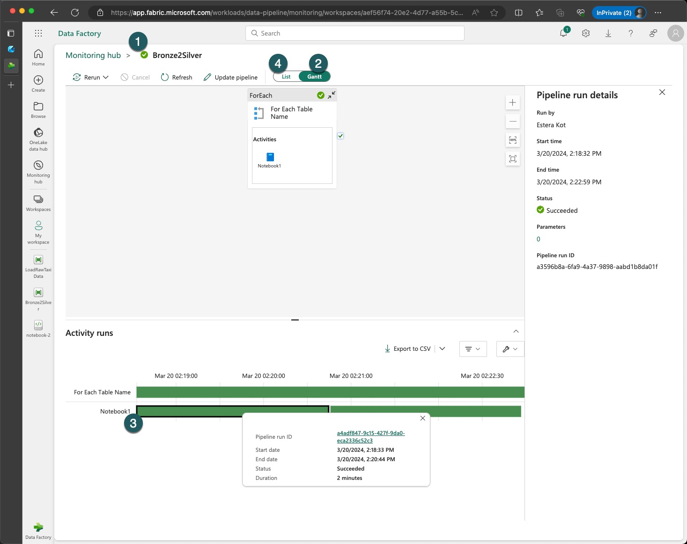
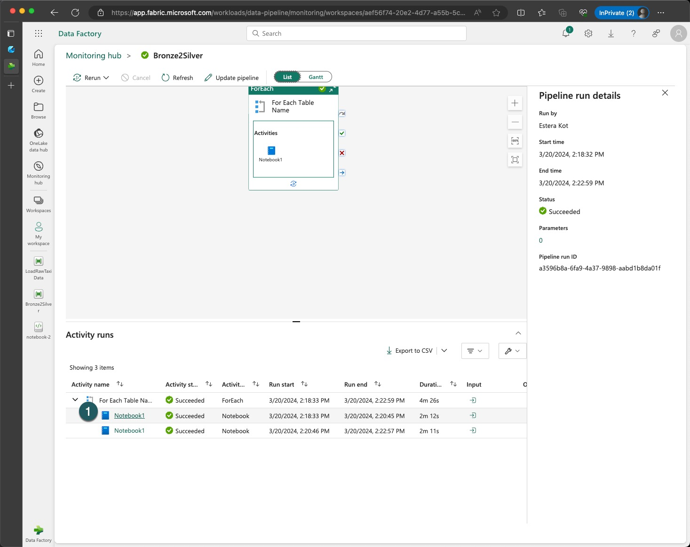
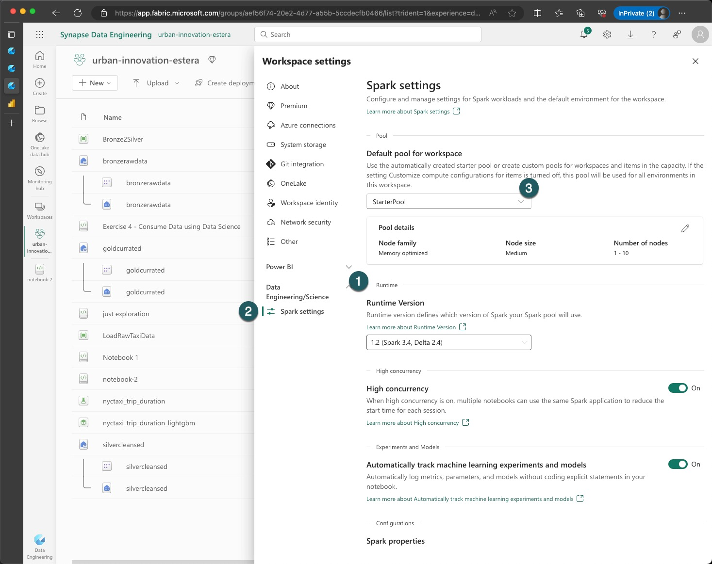
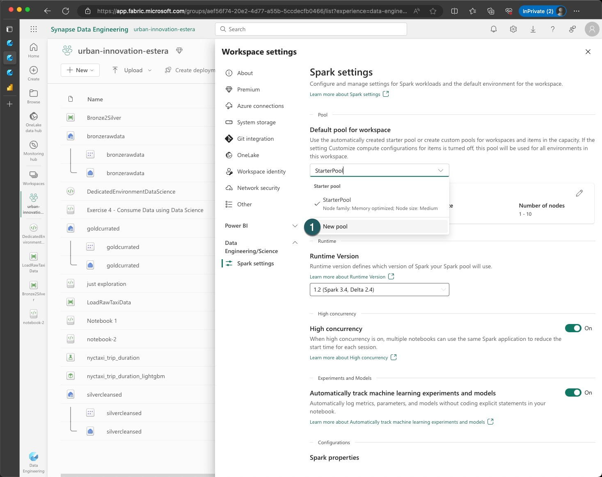
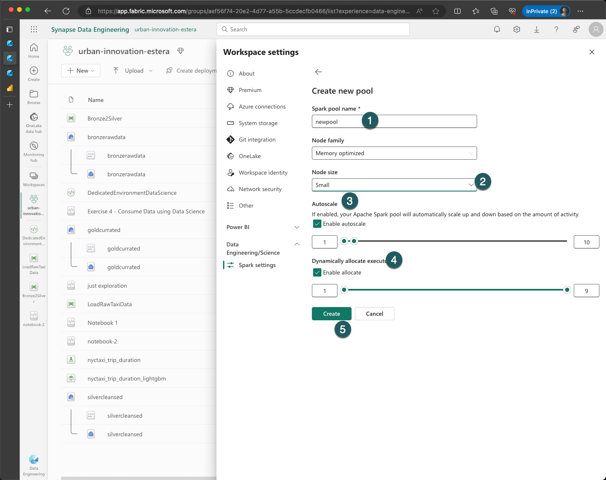

> [!NOTE]
> 
> Back to [Agenda](./../README.md#agenda) | [Start Steps](./../start/start.md) | [Exercise 1](./../exercise-1/exercise-1.md) | [Exercise 2](./../exercise-2/exercise-2.md) | [Exercise 3](./../exercise-3/exercise-3.md) | [Exercise 4](./../exercise-4/exercise-4.md) | [Exercise 5](./../exercise-5/exercise-5.md)
> #### List of extra exercises:
> * [Specify the file format and compression type for the sink datasets in Data Factory](##specify-the-file-format-and-compression-type-for-sink-datasets-in-data-factory)
> *  [Monitor the pipeline run and verify the output](#monitor-the-pipeline-run-and-verify-the-output-1)
> *  [Create a dataflow that reads data from a CSV file](#create-a-dataflow-that-reads-data-from-a-csv-file-1)
> *  [Medallion architecture](#medallion-architecture-1)
> *  [Schedule your notebook](#schedule-your-notebook-for-multiple-daily-runs)
> *  [Create a new Spark Pool on the Workspace-level settings]()
> *  [Saved with V-Order?](#verify-v-order)

---

# Specify the File Format and Compression Type for Sink Datasets in Data Factory

Based on Wikipedia, Snappy (formerly known as Zippy) is a fast data compression and decompression library developed by Google. It prioritizes high speed over maximum compression, offering significant speed benefits: 250 MB/s compression and 500 MB/s decompression using a single core of a circa 2011 2.26 GHz Core i7 processor. However, it provides 20–100% lower compression ratio compared to gzip. For more details, you can refer to the [Snappy article on Wikipedia](https://en.wikipedia.org/wiki/Snappy_(compression)).

Given this information, you might question the decision to use gzip instead of Snappy and how you can modify this setting. Here's how to proceed:

1. Navigate to Data Factory and open the first pipeline you have created, which loads raw data into a bronze Lakehouse.
2. In the pipeline, go to the 'Source' tab and then click 'Settings'.
3. The next step is to review all the compression types supported for the Parquet format. Deciding on the correct compression type can be challenging; therefore, let's compare the two main types: Snappy and gzip.

   - **Snappy**: As noted from Wikipedia, it is designed for high speed rather than maximum compression.
   - **Gzip**: This compression tool does not specifically consider the data structure within the file, but often results in better overall compression for Parquet files.

Your choice should be guided by what you intend to do with the data being loaded into the bronze layer and how it will be used subsequently, for example, whether it will be moved to the silver or gold layers and how frequently it will be accessed.

You can change your compression type in the settings menu of the source tab:



Based on benchmarks, gzip is more suited for long-term static storage, making it the preferred choice for data in the Gold layer. For data that is accessed more frequently (hot data), Snappy or LZO might be better options:


Choosing the right compression type depends on your specific needs: data access patterns, storage costs, and performance requirements.


---

# Monitor the Pipeline Run and Verify the Output

The Microsoft Fabric Monitoring hub allows users to monitor activities from a centralized location. Note that the hub only displays activities for items you have permission to view.

In this exercise, we will check the monitoring application for our pipeline and notebooks.

1. To open the Monitoring hub, select "Monitoring hub" from the navigation pane. The hub displays information in a table format, listing Fabric activities by start time, with the latest activities at the top.

2. Use the "Filter" button to refine the results in the monitoring hub table as shown in the screenshot. This makes navigation easier.
   

3. Based on the filtered results, open the specific pipeline as demonstrated in the following image:
   

4. Inside the monitoring hub, switch to the "Gantt Tab" to observe the notebook execution times. A successful execution is indicated by the prevalent green color.
   

5. Click on the name of the notebook you are monitoring.
   

6. In the notebook's detailed view, focus on two important sections: the Spark monitoring URL and the monitoring snapshot. Click on "Monitoring Snapshot".
   

7. Inside the monitoring snapshot, scroll through to view the executed values within the notebook, ensuring full transparency of the operations carried out.
   

8. Note the parameters section, showing how the notebook was parameterized, for instance with the table name "green201501".

9. Observe the execution details such as the duration, default lake house setting, and queue duration to understand the efficiency and performance of your job.

10. Return to the "Resources" tab to review metrics such as total duration, total idle time, and efficiency. A low efficiency percentage, like 15%, suggests there is significant room for improvement in the pipeline, code, and compute settings.
    

Consider sharing any optimization strategies with the workshop hosts and your colleagues to enhance the overall efficiency of your pipeline.


[//]: # (# Create a dataflow that reads data from a CSV file)


---

# Medallion architecture
A Medallion architecture is a data design pattern used to organize data in a Lakehouse, with the goal of progressively improving the quality and structure of the data as it flows through each layer of the architecture, starting from the Bronze layer, then to the Silver layer, and finally to the Gold layer.


This incremental and progressive improvement enables you to maintain data quality and structure while also improving data processing performance. Medallion architectures are sometimes referred to as "multi-hop" architectures because data flows through multiple layers.

One of the main benefits of a Lakehouse architecture is that it provides a simple data model that is easy to understand and implement. Additionally, it enables incremental ETL (extract, transform, load) operations, which means you can add new data to the Lakehouse in a scalable and manageable way.

Another benefit of a Lakehouse architecture is that it allows you to recreate your tables from raw data at any time. This is possible because Delta Lake provides ACID transactions and time travel capabilities, allowing you to track changes to your data and easily roll back to previous versions if necessary.

## Review the Medallion Architecture in Fabric Lakehouse

After performing data cleaning and transformation on your Lakehouse data, you can save the resulting data back to another Lakehouse to reflect the "bronze->silver->gold" pattern.

Here's an example code snippet that shows how you can write data to another Lakehouse:

```python
# read data from the bronze Lakehouse
bronze_df = spark.read.table("bronze_lakehouse_name.lakehouse_table")

# perform data cleaning and transformation
# ...

# write the transformed data to the silver Lakehouse
transformed_df.write.format("delta").mode("overwrite").saveAsTable("silver_lakehouse_name.lakehouse_table")

```
In this example, we first read data from the bronze Lakehouse using the spark.read method. We then perform data cleaning and transformation on the bronze_df DataFrame. Finally, we write the transformed data to the silver Lakehouse using the transformed_df.write method, specifying the path to the silver Lakehouse and setting the save mode to "overwrite" to replace any existing data.

Our real case, one more time:

```python
table_name  = "green201501"

data_collection = table_name[:-6]  # Extracts all characters except the last six (assumes these are non-digits)
extracted_year = table_name[-6:-2]  # Extracts the four digits representing the year
extracted_month = table_name[-2:]  # Extracts the last two digits representing the month

from pyspark.sql.functions import col, year, month, dayofmonth, avg

# !!!!
# READING RAW DATA FROM DEFAULT (RAW) LAKEHOUSE
df = spark.read.table(table_name)

# Calculate average fare amount per month
average_fare_per_month = (
    df
    .groupBy(year("lpep_pickup_datetime").alias("year"), month("lpep_pickup_datetime").alias("month"))
    .agg(avg("fare_amount").alias("average_fare"))
    .orderBy("year", "month")
)
display(average_fare_per_month)

result_table_name = f"{table_name}_avg_fare_per_month"

# Save the results to a new delta table - SILVERCLEANSED LAKEHOUSE - SILVER LAYER
average_fare_per_month.write.format("delta").mode("overwrite").saveAsTable(f"silvercleansed.{result_table_name}")
```


## Medallion Architecture Data Design and Lakehouse Patterns | Microsoft Fabric Data Factory

Watch Fabric Espresso episode as Abhishek discuss and demo the Medallion Architecture Data Design and Lakehouse Patterns in Microsoft Fabric Data Factory.  
[](https://www.youtube.com/watch?v=706MVIBivOU)


---


# Schedule Your Notebook for Multiple Daily Runs

In this exercise, you'll learn how to schedule a notebook to run multiple times a day using the scheduling feature, a simpler alternative to using pipelines for single notebooks.

1. **Access the Notebook**:
   - Open the notebook from the second exercise. 
   - Click on the scheduling icon presented in the screenshot to access the scheduling options.
     

2. **Configure the Schedule**:
   - Switch to the "Schedule" tab where you will find various options to set up your notebook's schedule.
   - Start by enabling the schedule function to make the notebook run automatically according to your specified timing.
     

3. **Define the Schedule Details**:
   - Set the notebook to repeat daily.
   - Schedule the execution times for your notebook, for example, at 7:00 AM and 10:00 AM. Ensure that these times align with your workflow and data processing needs.
   - Specify the start and end dates for the scheduled runs, defining how long the notebook should follow this schedule.
   - Select the appropriate time zone for your schedule, ensuring accuracy in execution times.

4. **Apply and Confirm Changes**:
   - After configuring the settings, apply the changes to activate the schedule.
   - Verify that the schedule has been set correctly and aligns with your requirements.

5. **Monitoring and Historical Analysis**:
   - Once the schedule is active, monitor the executions through the Monitoring hub. This will allow you to observe the runs and ensure they are occurring as planned.
   - Use historical analysis within the Monitoring hub to assess the performance and output of your scheduled notebook runs over time.

Ensure that the scheduling aligns with your data processing goals and operational hours. Scheduling notebooks to run during off-peak hours can help optimize resource usage and reduce costs. Document any challenges or insights gained during this exercise to share with your team or for future reference.


## Create a New Spark Pool with Workspace Settings

In this exercise, you'll be addressing the lack of dynamic job execution capability by creating a new Spark pool within the workspace settings. 

1. **Navigate to Workspace Settings**:
   - Go to the workspace view in your Microsoft Fabric environment.
   - Click on the three dots (ellipsis) to access the workspace settings.
     

2. **Access Data Engineering/Science Settings**:
   - Click on "Data Engineering/Science" and then select "Spark Settings".
   - Click on the "Default Pool for Workspace" and expand the selection to view more options.
     

3. **Create a New Spark Pool**:
   - Click on the "New Pool" button to start configuring a new Spark pool.
     

4. **Configure the New Spark Pool**:
   - Assign a meaningful name to your new Spark pool.
   - Select the node size for your pool. Although GPU machines might be available, for now, select "Memory Optimized" and choose, for example, a "Small" node size.
   - Enable auto-scaling to allow the pool to adjust based on workload automatically.
   - Enable "Dynamic Allocation for Executors" to optimize resource utilization during job execution.
   - Always remember to save your changes after configuring the settings.
     

5. **Finalize and Save Changes**:
   - After configuring the new Spark pool, Microsoft Fabric will redirect you back to the Spark settings screen.
   - A message will appear at the top part of the screen indicating that there are unsaved changes. Ensure to review and save these changes.
     

6. **Verification**:
   - Verify that the new Spark pool is listed in your workspace settings.
   - Ensure that dynamic job execution is enabled for this new pool.


Creating and configuring a new Spark pool with dynamic allocation and auto-scaling features can significantly improve the efficiency and performance of data processing tasks. Pay attention to the job execution times and resource utilization before and after implementing the new pool to measure the improvements.


# Verify V-Order

V-Order is a write-time optimization for Parquet files that enhances read performance under Microsoft Fabric compute engines like Power BI, SQL, and Spark. It applies sorting, compression, and other optimizations, providing cost efficiency and improved performance.

In this exercise, you will verify whether a table has been saved with or without V-Order optimization. 

1. **Prepare the Environment**:
   - Create a new notebook in your workspace.
   - Load a large table into a DataFrame for testing the effects of V-Order.

2. **Experiment Setup**:
   - In the first cell of the notebook, disable V-Order optimization and save the DataFrame as a new table.
   - In a separate cell, enable V-Order optimization and save the DataFrame as another table.
   - Execute both cells to create two versions of the table: one with V-Order enabled and one without.
     

3. **Verify File Properties**:
   - Navigate to the Lakehouse, then to Lakehouse Explorer.
   - Locate your tables, click on the three dots next to the table names, and select "View Files".
   - Enter the `_delta_log` folder and open the JSON files associated with both tables.
     

4. **Compare File Contents**:
   - Reformat the JSON files for easier comparison.
   - Check for the presence of V-Order optimization indicators, typically found in the tags section of the JSON log.
   - Pay attention to the number of output rows and the size of output bytes between the tables saved with and without V-Order.
     


Review the [Microsoft documentation on Delta optimization and V-Order](https://learn.microsoft.com/en-us/fabric/data-engineering/delta-optimization-and-v-order?tabs=sparksql) for a deeper understanding and context.  By understanding the impact and functioning of V-Order, you can make informed decisions about its use in your data storage and processing strategies. Remember, the goal is not just to see if V-Order is applied, but also to understand its benefits and implications.


[//]: # ()
[//]: # (## Use Environment to tailor your runtime)

[//]: # (![Monitoring]&#40;./../media/extra/18.jpg&#41;)

[//]: # (![Monitoring]&#40;./../media/extra/19.jpg&#41;)

[//]: # (![Monitoring]&#40;./../media/extra/20.jpg&#41;)

[//]: # (![Monitoring]&#40;./../media/extra/21.jpg&#41;)

[//]: # (![Monitoring]&#40;./../media/extra/22.jpg&#41;)

[//]: # (![Monitoring]&#40;./../media/extra/23.jpg&#41;)

[//]: # (![Monitoring]&#40;./../media/extra/24.jpg&#41;)

[//]: # ()
[//]: # ()
[//]: # (## DW vs Lakehouse?)

[//]: # (![DW or Lakehouse]&#40;https://microsoft.github.io/fabricnotes/images/notes/04-lakehouse-vs-warehouse.png&#41;)

[//]: # ()
[//]: # (![Two endpoints]&#40;https://microsoft.github.io/fabricnotes/images/notes/12-sql-endpoints.png&#41;)

[//]: # ()
[//]: # (## SaaS vs PaaS)

[//]: # (* ![Fabric Basic]&#40;https://microsoft.github.io/fabricnotes/images/notes/03-fabric-saas-product.png&#41;)

[//]: # ()
[//]: # (## Fabric Licensing)

[//]: # (* ![Fabric Licensing]&#40;https://microsoft.github.io/fabricnotes/images/notes/13-fabric-licensing.png&#41;)

[//]: # ()
[//]: # (## Fabric UI)

[//]: # (* ![Fabric Basic]&#40;https://microsoft.github.io/fabricnotes/images/notes/02-understand-fabric-ui.png&#41;)

[//]: # ()
[//]: # (## Fabric Capacities)

[//]: # (* ![Fabric Basic]&#40;https://microsoft.github.io/fabricnotes/images/notes/08-fabric-lingo-part-1.png&#41;)
